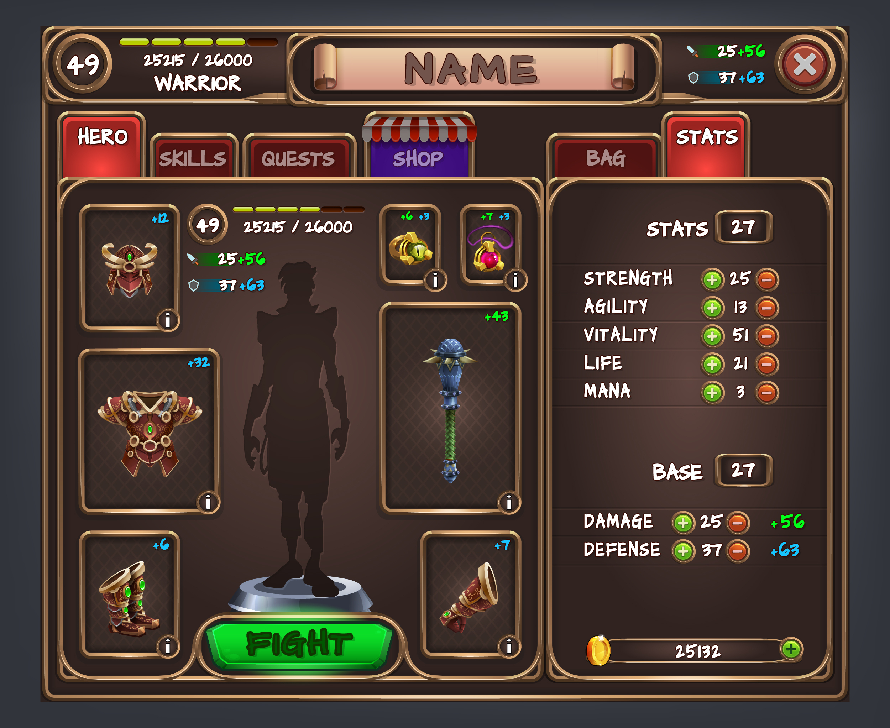
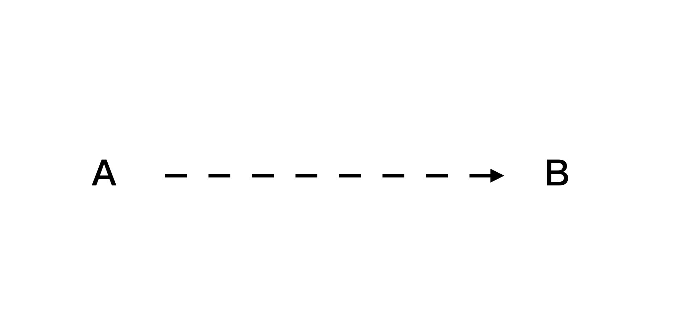
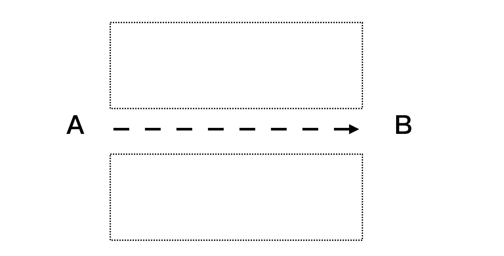

# 第二章：建立可見的學習目標(但逆著來)

我們在上一章，介紹了我們認知到的「學習」，其實是分成不同的 A 遊戲（填空記憶遊戲）以及 B 遊戲（RPG遊戲）。

而，我們日常對於學習的「通靈」感覺（有時候用盡了全力卻事倍功半，但是有時候無心插柳隨便學學確有如神助、事半功倍），多數來自於玩兩種遊戲時，用錯策略去通關所引起的。

我們習慣用 A 遊戲的手法去通關，在某種程度上，學校教育固定有其責任。但深層來說，也有另外一部分是我們自己的原因：

\> 我們人類不擅長去玩一個大型的無限遊戲。

當一個遊戲大到目標一眼望不盡、沒有規則時，我們通常不知道怎麼著手、拆解甚至進行下去。

所以不自覺的就躲回 A 遊戲的操作手法（ A 遊戲的目標、規則、積分是非常明確的。）作為避風港。

但是，一回頭去用 A 遊戲裡的戰略，去玩 B 遊戲。我們又被不確定的過程與結果，噁心的痛苦不堪。

究竟要如何破解這道難題呢？這其實就是本書超人學習框架要解決的事，介紹的手法：

1. 找到自己的學習目標
2. 對著目標逆向拆解成任務清單
3. 百倍速前進

## Step 1: 找到自己的學習目標

這裡讀者可能被弄糊塗了。為什麼要先設什麼「學習目標」？不就是「老師」或「書」上教什麼，我們就照著學嗎？

非也。這不叫學習，而是「帶練」，也就是一個人抓著你的手帶著你在遊戲裡面跑。

大多時候，你會覺得無聊。是因為人家拉著你的手練，你根本不知道自己在幹嘛。而且時間一久了，你還會覺得這個過程好無聊，想「離線」睡覺。

* 我們不知道為什麼自己要做這件事
* 做這件事的目的是為了什麼（不管是長期目標或者是短期目標）
* 做完之後自己到底有沒有進步

所以就晃神了。

不過，這也不是說人家拉著你的手帶練不好。因為如果你想參與一個遊戲，這個遊戲又龐大無比，並且沒有指引目標。沒有老手帶練，新手就像掉進一望無際的叢林裡，那種感覺更令人想登出。

那我們又要怎樣做呢？

答案是設立自己的狀態圖、儀表版、任務表。

剛開始各位讀者可能不覺得自己沒有目標也不會怎樣？我們在遊戲裡面通常也是沒有目標（不知道終點）的在做任務升級，甚至自己也只有一個模糊的方向：變強。但卻可以玩得津津有味。

這兩者的差異到底在哪裡呢？

答案在於，遊戲裡面有現實生活中所沒有的幾個機制：等級、技能樹、積分、排行榜。

在一個遊戲中，我們透過這些機制的輔助，確切可以知道自己曾經做了什麼努力，又得到了什麼反餽，自己又得到了什麼樣的進步，一直有一股自己在往前進的確定感、安全感、成就感。

你可能會覺得在學校時，重複背或練一個技能很無聊、很傻。但其實我們在遊戲裡，有時候也是一直重複的做同一個動作。但是我們卻樂此不疲。

這兩件事關鍵差異原因就在於：

* 在學校裡，目標也不是你設的，你只是被拖在地上狂衝而已。而人類一旦覺得目標離自己太遠、自己不知道自己在幹嘛、又一直輸時，自然就會想要離開這場遊戲。或者是投入到另外一個自己能贏的遊戲裡面。
* 在娛樂性遊戲裡，至少我們知道操作 A 會得到 B，知道自己現在的狀態。下一個小時自己又知道在幹嘛。而且自己可以看得到自己的當時狀態，以及往下一級又需要什麼努力。

你要覺得這場遊戲有趣且可以勉強進行下去，至少要時時在遊戲中

1. 能夠覺得自己離原先預想的目標越來越近。
2. 一目了然自己的儀表版，確認自己並沒有偏離航道
3. 一直能解開任務清單的小任務，取得升級。

所以無論是你的目標，是學習語言、學習編程，甚至只是學習「學習」。你都要至少要有一個目標。這個目標甚至是要是具體的。比如說學會可以在日本餐廳點菜的日文，學會做一個簡單的網站。讀書快二十倍等等。

### Step 2. 對著目標逆向拆解

有個目標對這套方法來說。是非常重要的。原因在於，所謂我們有意義的「任務清單」完全是得依賴「遊戲目標」去產生設計。

讀者聽到這裡可能會有點轉不過來「面對一個自己沒玩過不可知的旅程，把目標拆成可見的進度緩步前進。」

這件事聽起來好像是天方夜譚。沒有經歷過這些過程，又如何將目標拆成可行可見的進度來呢？

這問題雖然難，但並不是沒有辦法解決。甚至系列讀者可能看過我示範過。這個解題方法就是逆著來：

答案是：逆著來。

打造超人系列，最常出現一個解題手法，就是逆著來。

1. 寫下自己現在的狀態，以及想達成的目標。

2. 畫下一直線。並在這條線的上下方，寫下自己對於這件事所有的困難與抱怨。

3. 接下來再將這些困難與抱怨，反過來變成一個個題目，再將之分類。
4. 最後你就可以得到一個大致上可行的解題順序與戰略。

比如以學習這個題目，我們可能就會遇到的問題是：

- 學的東西老是背不起來
- 學東西時很累
- 沒有時間學習
- 開始學習不久提不起興趣
- 怕找到不好的老師
- 爛的老師上課很無聊
- 無法持續練習
- 刻意練習看不到自己的進步
- 讀書沒多久就想睡，看完又忘記
- 學的時候常常迷失目標
- ......

反過來變成正向題目就會變成

- 找到容易把學到東西牢牢記憶的方法
- 找到學東西很輕鬆的方法
- 整理自己行程，找到零碎時間學習
- 找到能夠讓自己學習 high 起來的方法
- 找到挑選好老師的方法
- 找到即使爛老師，你還是有辦法上下去，至少收穫一點的解法
- 找到能夠持續練習的關鍵原因與方法
- 找到方法讓自己能夠顯著看到自己得進步
- 如何讀書時可以很輕鬆，又記得大部分的方法
- 學的時候常常迷失目標

（這其實也是本書主要的主幹內容，是不是讓你很心動）

然後再把這些問題實際打 TAG 。於是上述正向題目就會變成

- 記憶方法
- 省力方法
- 省時間方法
- 上癮方法
- 挑選老師的方法
- 快轉老師上課內容，強硬擠出乾貨的方法
- 持續練習的方法
- 看到自己進步的方法
- 讀書方法
- 把握目標並且堅持往目標前進的方法

然後我們再把這些議題重新分類排序

就會變成：

- 建立正確目標
- 省時、省時間
- 找到老師
- 自學
- 持續練習、進步

就會得到模糊的大方向與小清單。

### 大谷翔平也在用的曼陀羅法也是類似的原理

到這裡，當然你會 argue 這些清單看起來還是有點模糊阿。但走到這個方向，真的就算已經有了不錯的方向。起碼別人來迷失在一望無際的大海裡。你卻已經至少往那邊游了。

#### 天才的背後，都有自己的清單

寫到這裡，我想介紹一個案例。大谷翔平。

美國職棒大聯盟選手大谷翔平，是現代職棒中相當罕見的投打雙修「二刀流」選手。大谷翔平作為投手，不僅擁有至今仍是日本職棒官方本土球員紀錄的165km/h驚人球速、令人昨舌的大幅度變化球；作為打者也擁有優異的長打能力，27 驚人的棒球天賦讓人嘖嘖稱奇。

看到大谷翔平的成就，你會覺得他是個天才。但背後真的是這樣嗎？我相信大谷翔平固然有天賦。但更關鍵的是，他知道怎麼玩自己的這場遊戲：

大谷翔平在高一時，為了磨練自己，曾經做了這樣一張計畫表。他將自己成為「八大球團大一指名」作為最終的目標，拆解成 8 個方向、64個可行的實作方向與方法。

透過這 64 格，他讓自己的目標非常非常的精確，自己可以逐漸掌握那些我們認為不可能掌握的進度與成果（如運氣等等）。

我們往往以為天才是靠運氣的、靠老師的。其實不光是大谷翔平，鈴木一朗也是有自己的目標與清單的。

(https://www.businesstoday.com.tw/article/category/80407/post/201703020015/%E5%BE%9E%E9%88%B4%E6%9C%A8%E4%B8%80%E6%9C%97%E5%9C%8B%E5%B0%8F%E4%BD%9C%E6%96%87%20%E7%9C%8B%E8%A6%8B%E4%BB%96%E7%9A%84PDCA%E9%AD%82)

這些的成就，都不可能是「帶練」，光靠前輩、老師堆積起來的成就。更不是透過運氣，亂湊出來的結果。你想要透過學習成長，至少要先立一個目標，才能漸漸的「飄」過去。

而逆向法的好處，其實是讓你有辦法在沒玩過遊戲前，就大致上能夠自己拆出「無限遊戲」的關卡方向。甚至還附帶以下好處：

1.  目標能夠被大幅縮短、集中簡化，甚至挖掘出這場遊戲真正的關鍵點
2. 不再無頭蒼蠅，且一定走的到最後目標。我們前進時最怕的就是迷失了方向，但走岔路這卻是不論做事或學習時，最常發生的情形。透過定位「最大的坑洞」，我們可以搶先反過來在有可能的坑洞上，先把坑填了或者是甚至鋪上一座橋，讓整個過程變的很順暢。
3. 進度可視化。因為原先的困擾是無窮無盡的。而當我們逆向寫下問題或煩惱時，這個數字瞬間從無窮盡，變成有限的問題，甚至是 10-30 個以下的問題。人是很現實的，如果這個目標太遠了，在解題過程中又遇到不斷暴增且未知解題時間的問題，很快就容易心生放棄。這個方法可以讓你直接看到解題所需要的數目，並且按照自己優先權或解決能力排序。當這個未解數目下降時，你很快就能感受到自己的進步。甚至可以開始預測當中確定需要的時間。
4. 一旦問題變小變短了。難度就降低了。甚至可以用粗暴直接的方式解題。粗暴直接符合我們人類內建的學習行為。你開始懂得抄捷徑，複製他人現有作法，不再重新造輪子。並且因為抄捷徑，你又能繼續快速感受到自己的進步，形成一個正循環。
5. 且最關鍵的是，當你把問題拆的比較小，拆的短了。很多問題的答案就容易找到方法，甚至每個「中」問題，都有一本書或一門課，能夠快速解決這些問題。這比自己在那裡瞎撞實在快多了。

當然，大谷翔平的這 64 格看起來很厲害。我想，當你第一次拆自己的目標時，未必一次就能到位。但我也相信這張表，也不是第一次他就做出來的版本。而是經過幾年時間，不斷的修改、調整而成。

不過，在學習的一開始，先立個目標，再逆著寫進度。無疑能夠讓你從原先的無限大遠目標遊戲，難度瞬間降低到幾個相對比較小的遊戲，從而容易進入正循環。

## 迭代挖掘找到真正的關鍵因素

在學習這個主題上，往往很多人認為自己學習能力不好的原因。是因為「記憶力不夠」「記憶很費力」的緣故，所以才導致自己「學不會」。但是透過逆向法分類挖掘以後，其實更能看出，真正關鍵的原因，是目標建立與進度可視化。

一旦目標對了、拆的小了。

我們很可能就突然解開原先一直卡住自己的那個關卡，找到一把金鑰匙，從而挖出後面一整片的真正關鍵字或流程，快速解開 50~80% 你目前正困擾的一大片問題。
