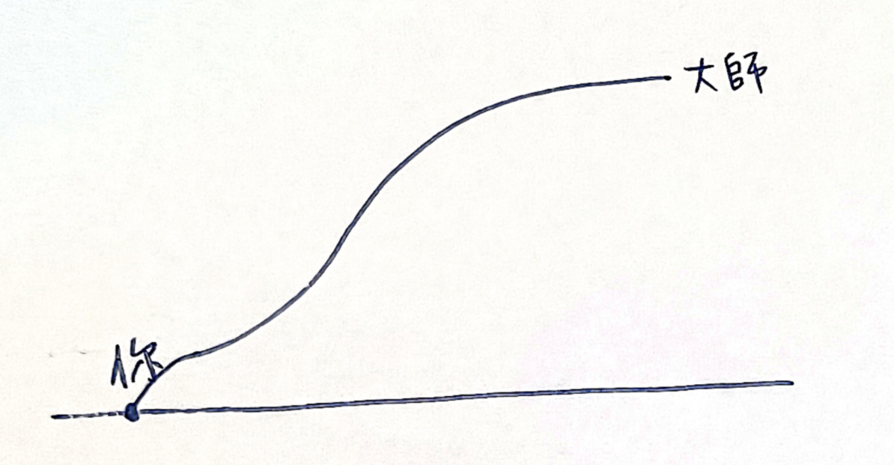
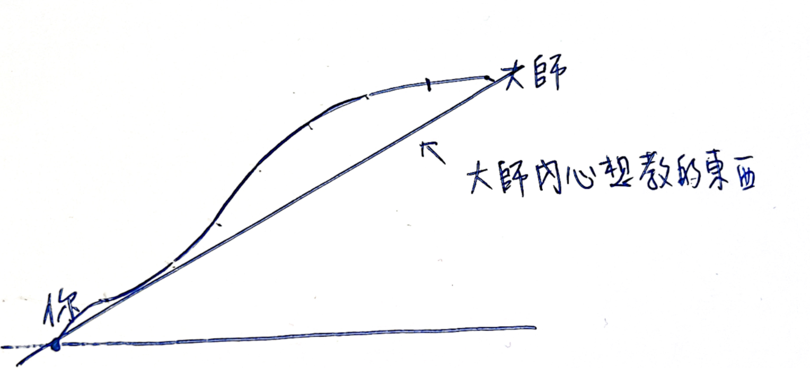
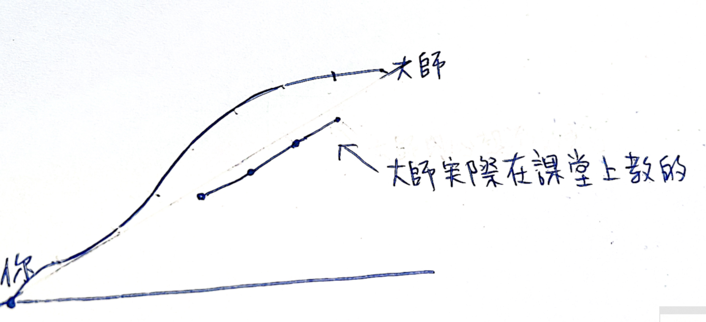
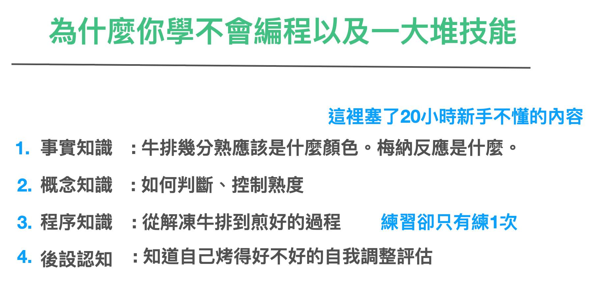

# 第三章 切西瓜從中間學起

我們前面花了兩章很大的篇幅，講了遊戲類型、目標與可視進度的重要性。

是因為這是因為遊戲類型的不同與遊戲目標的不同，關鍵決定了整個遊戲好不好玩、以及路徑時間有多長。

甚至可以說，我們在刻意學習當中所遭受到的痛苦，幾乎都是因為沒搞清楚遊戲類型所導致。而這個錯誤引發後面種種錯誤的決策與痛苦。

## 主動學習與被動學習

刻意學習，還分成兩種類型：一種是「主動學習」，一種是「被動學習」。

主動學習是我們自己決定我們想學什麼。而被動學習，是別人決定我們想學什麼。

我們前面提到的 RPG 逆向學習法，其實講的就是主動學習，而且還是高效的主動學習法。

而我們在學校接受的教育，多半屬於被動學習，別人安排我們學什麼我們就學什麼。

我們主動自己想學什麼，還是挑我們自己有興趣，且符合我們自己進度的方式去學。其結果，當然是比別人塞一堆我們不知道要幹嘛的東西，要來的愉快許多。

不過，寫到這裡，各位讀者可能會有點疑惑。遊戲裡面的 RPG，關卡不是也是別人設計的嗎？為何我們也玩的津津有味的？

### 老師也不懂設計正確的教學目標

這背後其實也有一個秘密。我也是當上教師以後，才知道的。

我們往往以為老師理當跟遊戲世界的設計者相同，都知道如何設計遊戲的目標以及關卡，帶學生走到正確的目標與道路上。

實際上，兩者的程度與設計目的差得很遠。

首先，遊戲設計公司，很知道一個遊戲的遊戲目標最後會是什麼，從而分解要到達這個目的當中適當的關卡與挑戰難度設計。而且，遊戲公司的目的，是為了讓你高專注力的成癮玩下去，甚至付費繼續留存，所以它們甚至會注意每分鐘你都保持在愉悅體驗。

一般的老師，可就差遠了。這當中有幾個關鍵因素：

* 多數的老師，只是領域裡面相對有經驗的人。它們只懂領域技術，並不懂的教學體驗設計。這兩者是不同的專業。
* 多半老師，講課只懂講述法，也就是他分享他的經驗給你「聽」。如果我們學習只聽聲音學習知識，可謂是十分費力。
* 更令人震驚的是，你以為老師懂學習目標設定，即便學習起來辛苦，按照他的道路按圖索驥複製，其實多半還是能夠走到最後道路的。但坦白說，多數老師，其實對於學習目標，其實是亂設一通而已。按照它們的設計，你根本什麼都不可能學得會。

聽到這裡，你可能會很震驚。但事實上，這種情形根本不罕見。

我們提到了，領域技術與教學體驗設計的功力，這是兩碼子的事。技術很厲害，並不代表這個老師很會教。

而且其實更慘的是，他設計的教學目標是不可能產出任何結果的。因為這一類型的老師，他的教學目標與教材是這樣設計的：

* 首先，把你與他的差距列出來。（甚至對方有可能是領域高手）
* 然後，他的目標是把你兩週之內，複製成他的功力的 1/10 。
* 於是，他只是把他懂得所有的知識，每個主題，片段抽 1/10 組成一長段的教材給你。

於是，這會產生以下上課情形：

* 老師上課口沫橫飛，看起來也非常厲害，但是你聽完後什麼都不懂
* 因為這些 1/10 的知識，容量也非常多，所以兩天的時間可能講不完
* 所以這些課程，內容就會變得很畸形，所有東西都講一點，所有東西都不深入
* 因為時間光講這些內容也不夠了，所以最重要的「練一遍」，甚至「練幾遍」，就直接被跳過了。

於是學生就會開始產生挫敗感：

* 老師程度沒問題，但我好像理解力有問題
* 上課聽不懂
* 上課想睡
* 回家練習一直失敗

這完全不是學生的錯。關鍵是當初這個高手，當初練起來的步驟，根本不是按照這個流程。

數學上將 1/10 知識拼湊起來，並不保證會有 1/10 的成果。因為學習功力根本不是這樣被累積以及測量的。

所以學習一門技術學不起來。有學生自己的目標設定問題。甚至也有老師的目標設定問題。

這就是為什麼我們在這本書的最前面，花了很多篇幅，講解目標設定的重要性。因為影響學習效果的因素非常多。但目標設定、流程規劃錯誤的後果重中之重。

## 不要從基礎學起，而從流程學起

另外還有一個關鍵的因素，是我們從往往覺得從一張白紙開始，我們優先要學會的是基礎知識。基礎知識學會了，我們才可以開始練習。

但這也是低效的作法。我這樣說各位讀者也會不太明白。讓我以教做菜的方式來比喻：

假設我們原先的目標是要學會一小時學會煎牛排。

如果按照剛剛複製 1/10 的知識，以及從基礎知識學起。

那麼課程就會變成這樣：

一個小時，課程的一開始老師帶著你看牛的解剖圖，每一種部位都跟你講適合幾分熟，並強調如果部位挑錯熟度，吃起來會很難吃。然後開始講解梅納反應的原理、以及我們要使用什麼樣的鍋子或烤箱去煎牛排，各種廚師喜歡用的烹調方法與流程。到了第五十分鐘才拿出一塊你也不知道是什麼部位的肉，接下來就快速的在你面前快速的煎一遍，然後就因為時間不夠下課了。

老師當場煎的牛排是很好吃。但是你回家發現，雖然上課抄了滿滿的筆記，下課複習時卻做不出來，不是肉裡面烤的太熟了，肉汁都流光了，不然就是怎麼煎都太生。然後你開始懷疑自己是不是沒有做菜的天賦。

聽起來這樣的教學過程很不合理。但事實上社會上各種教學大型翻車現場，都是這樣的。

那麼，老師又應該怎樣教？我們又應該怎麼學呢？

事實上合理的作法，以及會教的老師：

是直接挑選一塊新手也不容易煎壞的肉，幾分熟吃起來都不會吃起來太差，如無骨牛小排。然後現場直接示範肉要怎麼回到適合煎的初始溫度，肉放下去，看到什麼顏色就翻面。烤好之後要放幾分鐘吃最適合。最後讓你做一遍。

就這麼簡單。關鍵重點有幾個：

* 目標明確
* 不學跟這個目標「沒有直接相關」且「沒有做過一遍就無法理解」的知識
* 複製流程一遍，並當場練習
* 感受老師做的跟自己做的有什麼不一樣。有機會向老師請較如何調整參數，並實際體會幾遍。

## 從流程性知識開始學

聽到這個新流程，你可能會覺得哪裡看起來怪怪的。好像新流程看起來比較合理，但又感覺太簡單。只學這麼點東西，真的後續自己能夠把整套流程學會嗎？

那些底層的原理真的不需要瞭解與背誦嗎？我們過去的經驗好像都告訴我們，不熟基礎是很致命危險的。這樣「從中間學起」真的好嗎？

其實，這是因為我們「認知」的「基礎」，與實際上我們「需要」的「基礎」有很大的差異。

在整個教學世界裡面，輸入的知識分成四大種：

（知識分類表）(出自布魯姆教育分類學)

我們若將四大類套回牛排的例子，你會發現

* 從解凍牛排到煎好的過程是「程序性知識」。
* 牛排幾分熟，分成哪些肉質顏色。美味的來源梅納反應原理是什麼，是「事實性知識」。
* 如何判斷、控制熟度，是「概念性知識」。
* 知道自己烤得好不好的自我調整評估，是「元認知知識」。

你會發現，我們如果不先學「程序性知識」，先學一卡車「事實性知識」、「概念性知識」、「元認知知識」，似乎沒有什麼屁用，通常回家還是做不出來牛排，接著過沒幾個禮拜，甚至又把這些東希望得乾乾淨淨。

但是，如果我們先學「程序性知識」，因為記得那種「感覺」，後續的「事實性知識」以及「概念性知識」，反而比較好黏附在上面。因為「跟你的目標相關」、跟「之前學習的流程」相關。

這個發現可能會讓你感覺很震驚。原來我們從以前到現在竟然把「基礎」的定義搞錯了。

是的，甚至這就是我們從小到大花那麼多時間，在學校學那麼多東西，出社會卻忘的一乾二淨。而我們在職場上，不明就裡的按照前輩教的，糊裡糊塗過一遍，學習的過程卻很快，甚至不容易忘記的原因。

這就是為什麼我說整個學校系統的教育，實質上相當有害的原因。現形這套系統從小弄壞了我們的「目標設定」、「戰略設計」，甚至在學習上過程還讓我們進行「反方向」的學習。

這事實上就是 K12 每天在發生的事：在「短期測驗競賽」裡面測驗「事實性知識」的「記憶精確程度」，然後過兩週後通通忘記。

我們以為的教育系統，實際上不是教育系統。本質上 K12 的目的，比較像是本質是 KPI 導向的托兒所（工業化導向的社會，讓父母沒有時間教育孩子，只能將孩子送到集中教育場所）。老師的成就評量，其衡量水平不是讓學生成為「對社會有用」的人，而是整個學校擠進多少名校的名額。

且所謂的「程序性知識」，相對來說，很難被量化打分。以打分的設計標準來說，用「事實性知識」與「概念性知識」當作測驗提，以背誦的完美程度，作為 KPI 依據，簡單的多。

於是整個教學過程與目標才會扭曲成，上課只教一堆瑣細的豆知識，然後一群人 PK 誰背的完美無瑕。但最後卻沒有時間讓學生完整體驗一遍操作流程。反覆幾年循環下去，學生還被扭曲到以為未來的世界，就是如此運作的。學習也是需要這樣學習的。

到現在，我們講了

* 有限遊戲與無限遊戲
* 刻意學習與自然學習
* 被動學與主動學習

你可能會發現，其實我們人類天生的內建學習模式，本來就是比較科學且高效的作法。更別說我們還內建有超強的「鏡象神經元」複製功能，是目前電腦以及人工智慧所不具備的功能。

只是這些功能，我們一直被一些莫名其妙的社會系統所強制關閉而已。
