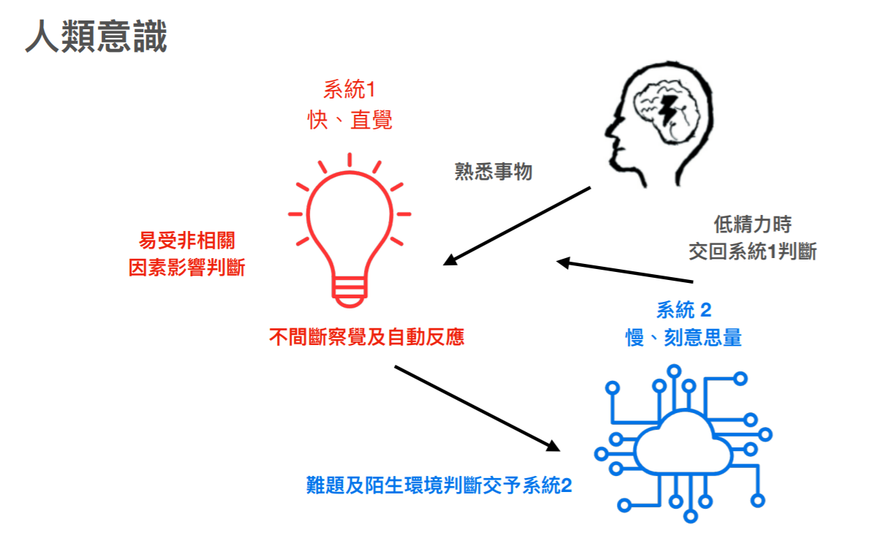

# 第四章 科學練記憶，談「記住」與「學會」

關於學習這件事，許多人最擔心的是學習之後，「記不起來」怎麼辦，特別是基礎知識忘掉之後，搞得寸步難行。

也因此，市面上關於記憶術的文章一直很夯。

### 所謂的學習，我們到底在追求什麼？

學完的東西記不住，一下就忘記了。我們要如何加強這個技能呢？

在繼續深入談這個話題之前，我想要先聊另外一個話題。

關於學習，我們到底求的是什麼？

我想很多人的答案是：「記住」與「學會」

但是，我認為很多人在學習這個主題上，把「記住」與「學會」兩件事混淆了。

常見的認知是以為用大腦「記住」了以後，就「學會」了。

實際上這兩個動作順序卻是相反的。

而正確的順序是，人類應當是「學會」了才會「記住」，而「記住」的未必「學得會」，是吧。

這句話看起來似乎有點道理，但是感覺有點繞。

讓我再繼續更深入敘述說明，這又必須從從長期記憶建構的原理開始講起。

### 1. 大腦的記憶結構是網狀搭建

我們常以為是記憶在大腦的構成是一點一點打上去，而大腦是一個容納我們無限塞東西進去的大儲物間。

但事實上大腦能夠長期被記住的東西是一片「互連」「網」，你丟進去的資訊，會被黏在既有相關的網子上。或者是你經過刻意整理（筆記、領悟），將學到的東西組成一片自己的網子。

也就是說，最後：

- 有邏輯能夠理解的事情才容易被記得住
- 有相關性的東西才會被記得住
- 有結構的東西才會被記得住

所以，一件事情當下你不明白、沒有相關資訊的網子可以黏附、事後又沒有整理，那麼這個資訊瞬間就會被沖掉。

（這就是為什麼故事比理論更容易被記住。因為，故事是一個有趣且更完整有組織的結構。）

### 2. 肌肉也能記憶東西

再者，我們往往以為只有大腦可以記東西，但實際上，身體也能記東西。

所謂身體的感覺記憶，原理是身體執行動作時，會給神經纖維帶來脈衝。而髓鞘質所謂的記憶神經迴路是電流脈衝傳過神經纖維。髓鞘質是包裹在神經通路外側的一層絕緣物質，當練習用到某部分神經通路時，這部分的髓鞘質就會生長起來。練習得越多，絕緣層越厚，通路中的信息傳遞速度就越快。這就是所謂的「肌肉記憶」的效果。

精確的來說，被用來記憶的東西並不是肌肉，而是神經束。你越練，身體上的電線，越練電線越粗，電線皮越厚。所以信號速度傳的越快，而且越不容易被忘記。

### 3. 人腦會拼命遺忘

為什麼我們會忘記一些不久之前上過的課、讀過的書內容。有兩個原因：

(1) 資訊沖刷

這是因為你可以想像，輸入人腦的是無窮無盡的一束資訊流，我們暫存這道資訊流的空間有限。你又可以把這比喻為機器的 Log（記錄當日每一起發生事件，但是暫存區滿了，就會按照時間把舊的資訊推掉，只留下最近的）。

如果我們不在還在暫存區暫放的時間，將裡面有用的資訊「整理」放回能夠相對保存較久的儲存空間，如大腦、神經束。

這些訊息就會被自動沖走

(2) 記憶失去連結

神經是網狀連結。理論上當你把資料搬去這些儲存較久的空間去存放時，保存時間可以比較久。但是，太久沒存取，可能連往這一片的記憶的連結就斷了。

你可能經歷過一些類似情況。有一些技能或知識，某幾年你真的很熟，但放在那裡很久沒用了，需要回想一陣子才能挖回來，但一挖回來之後又能熟練使用了。

### 大腦的記憶冷藏時間只有一天

在講記憶法的相關書籍，有一個概念「**艾賓浩斯遺忘曲線」**經常被提起**。**

心理學家赫爾曼·艾賓浩斯通過自己的實驗提出。在這一實驗中，艾賓浩斯使用了一些毫無意義的字母組合。通過記憶這些字母組合，並在一系列時間間隔後檢查遺忘率，得到了這一曲線。

- 20分後，42%被遺忘掉，58%被記住。
- 1小時後，56%被遺忘掉，44%被記住。
- 1天後，74%被遺忘掉，26%被記住。
- 1周後，77%被遺忘掉，23%被記住。
- 1個月後，79%被遺忘掉，21%被記住。

所以，通常研究記憶的學者。會希望我們讀完書、上完課之後，要立刻複習，否則會容易忘記。

但其實只敘述「暫存區儲存的時效問題」。

他們還少說了好幾件事，如果你要把這些東西記起來：

* ㄧ、首先第一件事，這些資訊必須要「你在乎」，「在乎」的意思表示與你當前目標相關。
* 二、這些資訊要以一個網狀結構才能儲存。也就是
  - (1) 你能夠理解當中的邏輯
  - (2) 可能用一個故事包裹著
  - (3) 這些資訊要與你的過去經歷可以連結

所以，我們過去求學中，比較會教書，你也比較容易學會的老師，通常很會使用：故事、淺顯比喻，甚至順口溜。讓你記得比較輕鬆。

### 我們將肌肉記憶的重要性低估了

學校教育有一個傾向，大大傾斜向「大腦記住」的重要性。至於「實驗」「練習」課，這些課程，卻容易被犧牲掉。

因為沒有了「實驗」「練習」課，學生也就沒有辦法體驗到利用「實驗」「練習」所帶來的記憶美妙感。更甚至不知道「實驗」、「練習」所帶來的「肌肉記憶」的威力。

所以，多數人在這樣長久的訓練當中。會嚴重把「記住」與「學會」兩件事混淆。以為「記住」過程就能夠把一件事情學會了。實際上要「學會」一件事的標準，是重複操作一件事不失誤。

但重複操作用的是肌肉不是大腦。而我更大膽的進一步說，把資訊記錄在肌肉裡面，反而可以突破大腦記憶被沖刷掉的存鮮時間限制。

### 談腦記憶與肌肉記憶

為什麼肌肉記憶可以遠比大腦記憶更牢靠？

你是不是有類似這樣的經歷：

不管你是什麼大學畢業的，在大學畢業前的課程，你幾乎都忘光光還給老師了。但是，出社會以後學到的業務技能，大部分卻蠻熟練的。記得很牢。

小時候喜歡的嗜好，比如說練跆拳道、踢足球、玩桌球、青年的時候組裝電腦、玩射擊遊戲。長大後雖然會略微生疏，但手感通常卻依然還在。

這是為什麼呢？

### 陳敘性記憶與非陳述性記憶

歷史上有個很有名的失憶症患者 H.M.。

1953年，他受了一項實驗性精神外科手術，切除左右腦的部分海馬迴組織，企圖減緩一直困擾他的癲癇。沒想到手術後帶來了無法想像的後果。這項手術造成他從此再也無法產生新的記憶。每天連跟誰說過話、吃過什麼都記不得。

不過對於 H.M. 的這項悲劇，卻對人類來說是個很好的贈禮。他同意了讓一位神經科學家，在之後的幾十年內，作為研究對象，探討記憶的奧秘。

而針對 H.M. 最有趣的研究發現。他會忘記每天發生的各種事。雖然失去了記憶能力，但是卻不會失去技能能力。

神經科學家將 H.M. 失去的這種長期記憶稱之為**陳述性記憶**。而 H.M. 記得的有關動作技巧的長期記憶，稱之為**非陳述性記憶**。

我「認為」這件事形容的並不精確。因為關於長期記憶，特別是「記憶」這個詞，我們會認為，都儲存在大腦裡。

事實上，若按照刻意練習加粗電線的理論。

我認為長期記憶的運作應該是如下圖的：

關於「事實性」「概念性」的知識，被存在大腦裡，過了不久就被沖掉。

「程序性」知識則被存在神經裡面，被髓鞘質保護起來。

這才能解釋為什麼我們會隨著時間的衰退，會逐漸忘記陳述性記憶的知識。而練過的技能幾乎很難忘記。

### 鍛鍊系統1而非系統2

當然，這只是我的假說。但後面我會證明為什麼這個理論才是比較貼近現實的。

在丹尼爾‧康納曼《快思慢想》這本書裡面，有個著名的系統1與系統2理論。

指出人腦的運作機制分為系統1與系統2。

- 系統1代表是反射性直覺思考
- 系統2代表的是按部就班分析的理性思考。

而程序性知識儲存調用的地方就是系統1，而概念、事實、元知識調用的地方在系統2。

在快思慢想裡面這本書裡面，指出了人類意識與行動，多由系統1直覺自動完成，系統2省電待機，只有在遇到難題與陌生環境時，系統2才會清醒改變決策。而系統2擁有最後的決定權。

「快思慢想」一書，提到系統 2 擁有最後的決定權。這樣的說法好像乍有道理。

但是身為工程師，我卻覺得這樣的說法非常不合「計算機」設計的邏輯。

這是因為系統1決策執行的速度大約是15ms左右，但是系統2的速度要到500ms以上。

如果將這種速度畫為系統圖，人類應該長的是這樣：

我們身體是由一系列的快速的小型子程序自動運作。

學術界有一個理論，是人類應是理性人（特別是金融、經濟學都以此為假設），但實際上這可能完全非事實。

因為如果人類是理性人。那這整個系統，決策應該是多數系統2主導。但在通訊執行速度上，系統2是完全幹不過系統1的。

於是在當人類情緒上來時，整個人會呈現這樣的狀態，理智下線。

人類甚至在急的時候，甚至會產生一個現象：「說話不過大腦」。

所以比較合理的情形，應該是：

人類平時都是以一個待機模式在運轉，通常是遇到過去沒有解決過的問題時，才會呼叫系統2出來搜尋判斷可能解決的方法。

但所謂的理性，也只是慢下來，去搜尋過去可以快速解決的方案。

而人類本質上是一連串的無意識快速系統疊加組成，所以我們平時執行任務的時候。其實是由無數的系統1疊加串連組成結果。

當我們在講人類多數是使用系統1在自動執行，系統2平常是在睡覺時。圖其實是比較像這樣的：

系統2根本不是主駕座位的那個人，而是在副座看到人家開車卻誤以為是自己開車。當遇到問題，才去踩1的煞車。

當我們講刻意練習時，卻很常會容易以為我們要練的是系統2。

事實上，我們卻應該練的是系統1。

### 刻意練習的對象應該是程序性知識優先並寫進系統1

在幾年前，很多被傳統教育荼毒的人，聽到肌肉式學習這個字還會訕笑。覺得是義和團式的學習法。

實際上這個切入角度卻是最科學無比的，而且反而容易深植持久的。因為人類本身就是由無數的小型子程序接續運行。甚至人體還會不斷讓子程序的回路，長得更健壯，分泌物質讓回路保護層更厚。

所以在學習策略上。最正確的途徑，應該是學習程序性知識為主架構（骨頭），練習熟練後（且不容易忘），再吸收事實知識（做為肌肉）補充。

套用回來一般技能學習拜師的場景，就是：

1. 先跟老師不明就理的學習基礎常見的流程
2. 當場做出成果後。回家短時間練三遍也重製成果三遍
3. 再針對你不懂的部分去補充基本知識。

而不是去背什麼一大堆名詞，最後再自己亂組句子，最後說不出一具完整的話。

因為，做為一個初學者，你是根本無法從事實性知識（名字）倒推出常見的基礎流程（句子結構）與必要的有限正確知識（該在什麼場景使用，細微的語氣以及界系詞）的。

所以，我才會反覆的強調先習「流程性」知識的重要性。
