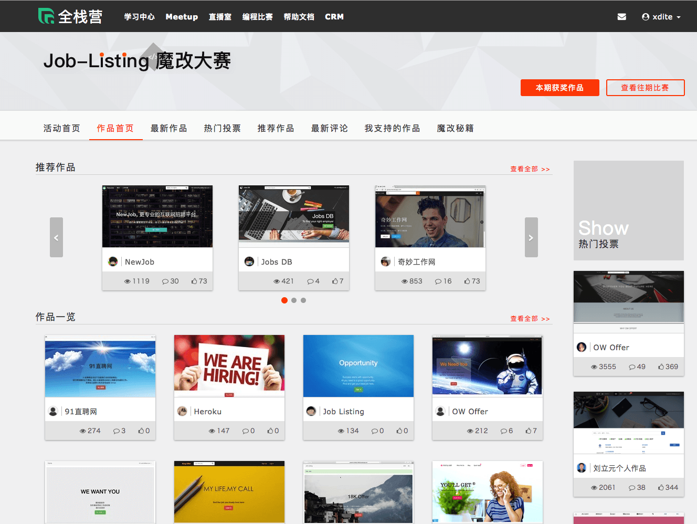
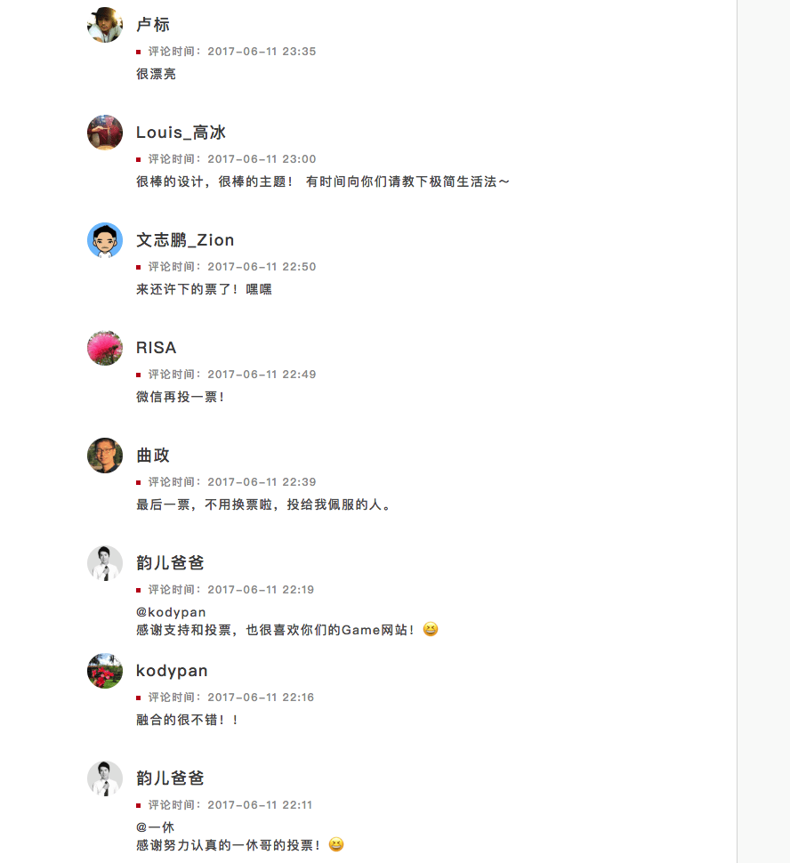

# 第八章 心流學習法「技能實戰篇」

在 2017 年。我曾經打造過全世界最大的程式在線學習 Codecamp「全棧營」。

這個項目在最後結課時，全程跟完課的學生高達 70%，上課的學生背景都是無計算機背景的小白。

這個 codecamp，時長總共 2 個月。很多學生對於自己能撐過兩個月，甚至還對編程上癮，感到無比神奇。

> 學生心得：一次又一次的上癮，沈迷Coding

> 學生心得：編程開發已經成為了一個上癮的事情，會在很多場景很多時段來思考網站應該如何去做，以及如何借鑒別人的網站。 同時也更加瞭解自己的學習曲線，有了更加堅韌的學習意志。

## 2017 讓學生線上學編程持續兩個月，最後還成癮的「全棧營」

讓我來拆解全棧營是怎麼做到這一點的。

### Stage 1: 目的 --- 史詩意義與使命感 Epic Meaning & Calling

在報名課程之前，我就將這次學習的目標訂為「脫胎換骨成為下一個想要的自己」。

(這也是報名問卷上，許多人最想要上完這門課的效果)

明確定義，此次學習目標，是有辦法在一年內練成有辦法自己結合原有興趣並動手實做產品的全棧工程師。

### Stage 2: 遊戲玩法 --- Routine

在課程的一開始前三周，我們設計了幾個教學關卡，讓學生掌握寫網站的基本幾個套路。

在這個階段，學生已經有辦法搭起一個簡單的論壇成果。

### **Stage 3: 第一個小勝利 --- Ah-ha Moment**

然後緊接著，我們舉辦了第一次的線上開發大賽。請學生利用前三周的學習，改版成一個有特色的招聘網站。

這個招聘網站的實做難度並不高。難度在於使用者多增添一些特色功能與裝潢自己的網站。

能夠做成這件事讓學生感受到自己也是有能力的

### Stage 4: 技能進步 --- 進步與成就感 Development & Accomplishment

在這個過程中，學生可以感受到自己的學習進度。

### Stage 5 & 6: 角色養成 --- 所有權與擁有感 Ownership & Possession & 獨特的寶箱獎章 --- 稀缺性與渴望 Scarcity & Impatience

在上課的過程中，參與課程的作業進度，繳交的作業，收穫的獎章，參賽的作品，都會收錄在個人主頁上。

### Stage 7 & Stage 8 驚喜的關卡 --- 未知性與好奇心 Unpredictability & Curiosity & 體驗社交分享 --- 社交影響與關聯性 Social Influence & Relatedness

全棧營一期總共有兩次大賽。一次是 Job Listing 大賽，一次是 JDStore 大賽。比賽主要是在挑戰：

- 如何拆分任務以及與隊友偕同合作
- 代碼實做能力（Github 原碼公開）
- 產品完成度
- 人氣度

這個大賽促成了幾件我們意想不到的的結果：

- 同學們互相觀摩 Github 原始碼，互相進行功能上的學習
- 同學們在論壇上，互相分享教程文章，指導其他同學加功能，順便為自己的作品拉票
- 互相在作品頁面上留言打氣
- 學員在拉票與競賽的過程中，互相吸收到陌生人與親友的打氣與幫忙。充滿驚奇與收穫。許多同學甚至上班請假櫓代碼，就為了能專注贏的大賽

## 全棧營學生感想

第一次結營。我收到 94 份心得感想。節錄部份心得如下。大家可以感受到這個編程課的威力。

> 参与全栈学习这么久，你觉得自己和之前最大的不同是？学会了主动学习，对自己更加自信，不再惧怕挑战。每日写orid，让自己的逻辑更加清楚。用主动学习的方法，多次做提取练习，感觉自己学东西的速度变快了。非常珍惜自己的注意力和时间，在自己的高效时段，都是把时间花在学习上。以前很孤僻，现在很喜欢交新朋友，并且主动帮助需要帮助的人。感觉自己的幸福感，有大大增强。并且帮助别人后，会有很多意外的收获。用16格做笔记，读书和读文章的留存率大大增加。并且还会尝试写笔记与朋友分享。以前如果让我做什么，我从来没有做过的事情，我肯定会觉得害怕，但参加全栈营后，不再害怕了，只要拆解任务，然后就可以顺利完成了。

> 参与全栈学习这么久，你觉得自己和之前最大的不同是？对任何新领域新知识的学习，再不惧怕，且有比较明确的方式，通过不断做小产品，不会通过埋头坑基础知识来消耗自己的意志力与对新领域的兴趣与好奇心，而是主要以做小西，让自己开心为目的，不断前行，及时在听到很多牛人前调基础知识的重要性，我也决定要在保持自己内在战斗力和兴趣的前提下，去学基础知识。解bug的过程中，英文阅读能力有巨大进步，且萌生了想练英语口语，去国外工作的冲动。彻底淘汰了过去的垃圾学习方法发现世界好大，好美丽

> 参与全栈学习这么久，你觉得自己和之前最大的不同是？在全栈学习中逐渐习惯了，将自己知道的写成技术文档，在这个过程中就是再一次的知识提取。从你以为你明白了，到你真的明白了。以及肌肉记忆到底是个什么鬼，也终于明白了一些。 最大的不同在于不明白的地方不在过于着急了！也逐渐从有问题问“度娘”，变成了问谷歌。突然感觉世界一下子清楚了不少！

## 把編程課作為電玩去打造

為什麼這門課會有這麼巨大的威力。是因為我是按照遊戲界設計遊戲的思路，去設計的這套課程。

一般來說，講到將課程遊戲化，多半指的是是 PBL (Point-Badge-Leaderbord) 這套機制放入課程系統。

但是，我並不是這樣做的。

具體來說，我是遵照參考遊戲基本結構與玩家動力去設計。

### 遊戲四階段：Discover / Onboarding / Scaffolding / Endgame

遊戲業界在設計遊戲時。會將游戲會分成四個階段：

Discovery => Onboarding => Scaffolding => The Endgame。

遊戲設計師會在遊戲設計中遵循這樣的設計套路。確保玩家在這個過程中，逐漸養成對遊戲的摸索，習慣，甚至上癮。

確保每秒鐘都沈浸在這個遊戲裡面。80% 以上好玩的遊戲都伴隨著這個套路。

一般的設計流程是：

在遊戲Onboarding 階段。遊戲會在這個階段植入一個Epic Calling （使命召喚），讓玩家明確知道遊戲的目的是什麼。比如餐廳類時間管理遊戲，玩家的使命就是開一間牛逼的餐廳，餐廳可以準時上菜。比如說狙擊遊戲，玩家的使命就是成為二戰裡面戰役的傳奇狙擊手。

接著在前幾個章節，透過一系列的小的教學關卡，讓玩家了解核心玩法，養成「遊戲裡面具體的操作習慣」。

並且透過小成就，讓玩家取得第一次的ah-ha moment（小胜利）。

以狙擊遊戲來說，就是在第一章的關卡，會透過一些小系列的事件觸發，讓玩家學習怎麼跑步，低蹲，埋伏，進入掩體，瞄準射擊刺殺。然後在第一關的尾端，安排一個難度比較低的大boss 讓玩家嘗試刺殺，讓玩家覺得自己當狙擊手，真是超有天賦！

而後在後面的過程中，玩家會逐漸體會到自己有明確的升級。並且會投入心力培養培養自己的角色。而後引入稀缺這個元素（蒐集寶物）。

以狙擊遊戲來說，在遊戲進行過程中，玩家學會闖關後，下一步的精力，會花時間在培養自己的角色，針對自己擅長的打法，去升級屬性，升級槍枝。調整自己身上背的槍SET，改裝槍的零件，提高射速與子彈攜帶數量。

然後，在闖關過程中，無意中會找到一些稀有寶物，以及觸發一些徽章。有一些玩家甚至於執著在不斷的重玩，以取得金牌獎章。

當中，不斷出現的意外驚奇，也會掀起玩家的挑戰與好奇心。

最後，遊戲在最後面，還會提供「社交分享」的元素。玩家可以社群網路上分享自己的擊殺視頻，以及分享自己的徽章截圖。享受來自朋友的崇拜。

這就是為什麼玩家在遊戲裡面沉迷到不可自拔的原因。

玩家在遊戲裡面可以體會到自己隨著技能熟練度不斷成長。對於下一個挑戰有著高度的期盼。並且每學會一項新技能，或每闖過一個新關卡，都會得到令人驚喜的獎勵。

所以，玩遊戲是一個越來越開心的過程。

你可以將這段對比，對照前一章「2020動物森友會」與「2017全棧營」，看看結構是不是非常相似。

## 人類為什麼討厭在學校學習，而沉迷於遊戲。

你會疑惑，學習能做到這樣嗎？

其實是可以的。現在上學非常無聊。是因為90% 的學校教育與課堂，往往是講述法，這是老師授課最方便，但是學生上起來最痛苦，同時學習效果最差的一種方式。

內容不有趣以及難以吸收（聽完就忘記）的體裁，任誰都會覺得學習是一件痛苦的事。

再來，一般的課程設計，並沒有明確的教學目標設計，也就是老師是基於自己會什麼就去教什麼。

而不是實際設定並測試過目標，學生學完這門課程會實際變成什麼樣的人。

自然學生在學習時越來越迷惘，甚至開始懷疑起自己。

在這個過程中，既學不到東西，又沒有目標，寫作業又缺乏正反饋。自然沒有人願意學下去。

為什麼遊戲那麼令人著迷呢？

這是因為在遊戲裡面，一切都與「教育1.0」都是反的。

跟現實課堂學習不同，遊戲有著清晰的目標，在遊戲裡面不管做什麼動作都是有清楚的反饋。可以看到自己的成長，並且還有現實中沒有的獎勵系統。

很多人在現實學習成績不怎樣，在線上大逃殺遊戲裡面可是各種改裝、閃躲、壓槍、狙擊技巧，出神入化。可見根本不是學習能力問題。

而是學習的體裁、設計、傳授方式出了很大的問題。

很多人以為將教育遊戲化，是照搬遊戲裡面的元素，諸如點數、徽章、排行榜。

這是只見其表。

一切的根基在於「目標設計」、「單純的學習體裁」、「即時反饋機制」、「適時的動力機制」與「變動獎勵機制」。

## 如何將遊戲體裁移植到自學上，並且對學習成癮？

我之所以自學東西非常快。正是後來摸索出這個套路後，也把他移植到自己的自學系統了。

而這套框架，也是一般正常人的「英雄之旅」。

### Stage 1: 目的 --- 史詩意義與使命感 Epic Meaning & Calling

首先，我會為自己立下一個很厲害的學習目標。

比如說要一天做出一個網站、一天寫出一本書。做出一個能讓大家在線上學習編程還能高度成癮的線上課。3分鐘就可以分析完一份財報並做出投資上的判斷。

這種前所未有沒有人達到的目標，我會很想要挑戰看看！

### Stage 2: 遊戲玩法 --- Routine

這件事當然不是一步登天。現實也沒有現成方法。

我就會把這個大目標，拆解成非常小的問題。（而且這個小問題，要簡單到讓我足以行動。）

甚至看很多書，只謂搞懂最小的問題知識點。（詳見本書第7章）

接下來，我會想辦法找到第一套程序性知識。做出第一個小套路。完成第一次快速小達標。

### Stage 3: 第一個小勝利 --- Ah-ha Moment

當我做出第一個小達標：

- 一週做出一個網站
- 一個月寫完一本書
- 做出一個杜邦分析法圖象化拆解財報五年 ROE 結構時

就會有很強的進步感與自我肯定。

### Stage 4: 技能進步 --- 進步與成就感 Development & Accomplishment

於是我會基於這樣的成果。

尋找第二個小套路、第三個小套路。

最後再把這些套路，組起來變成大套路。完成更加驚人的成就。

比如：

- 一天能做出一個網站
- 一週寫出一本書

### Stage 5 & 6: 角色養成 --- 所有權與擁有感 Ownership & Possession & 獨特的寶箱獎章 --- 稀缺性與渴望 Scarcity & Impatience

接著，我可能就會去參加大賽，試探自己的能耐到哪。也看看自己的能力是不是獨一無二的。

所以我會去參加 Facebook 黑客松。

並且挑戰一天寫出一本書，這種奇怪的事情。

### Stage 7 & Stage 8 驚喜的關卡 --- 未知性與好奇心 Unpredictability & Curiosity & 體驗社交分享 --- 社交影響與關聯性 Social Influence & Relatedness

而且，在這過程中，激勵自己最好也最簡單的方式。

就是我會把我的攻略與作法分享在網上。

這是最快取得「獎勵」、「變動獎勵」與「社交影響」的方式。

因為當你公開作品，一定就會有人稱讚你。

你不認識且有名的人稱讚你，對你來說就是一種「變動獎勵」。

而且發表這些攻略，也會讓你在社交影響力上取得滿足感。

## 為什麼一般人的英雄之旅會失敗？

當然也有人會問：這就是普通人奮鬥的道路阿！

沒什麼特別的！

是阿！但為什麼我（現在）做得到。但以前的我，會現在其他人做不到呢？

### 動機與能力

耶魯大學的 B.J. Fogg 2009 發表了一篇論文，總結了如何從設計上提高轉化率，行為的發生，關鍵公式是Motivation-Ability-Trigger（動機-能力-觸發)

提到 Behavior（行為） = Motivation（動機） x Ability （能力）x Trigger （觸發）

做為學生。不去行動的理由有千百種。但是總歸原因下來大底是兩條：

- 門檻太高
- 動機不夠

### 能力不夠

我們作為學生。很多人是想要一步登天的。

- 上來學東西就摒棄新手教材，專挑難的。
- 跟老師學東西，還沒跑通第一遍流程，就想要修改變成自己的版本
- 很多最基本的疑惑都沒有解答

俗話一句：「步子邁太大扯到蛋」。

所以我在自學時，就非常警惕。一定要讓自己在學習過程裡面，反而是挑簡單、懂的學。

看不懂就跳過。所以我自學時買的都是超簡單新手教程。

然後把大師的書只當字典查。

可以的話去抱大師開的新手班，快快樂樂學套路。

### 動機不夠

當我發現自己能力夠，但動機不強，所以無法持續時。

我就會去思考，為什麼我沒有動機繼續練呢？是因為我不需要。

還是「短期」的「動力」刺激不夠。去八角框架裡面找一個能讓我產生強烈動力的元素，掛勾上去，我就充滿鬥志了。

（比如說對一般人最有效的可能是：金錢、社交資本。對我比較有效的可能是社交資本、稀有性以及史詩召喚。）
