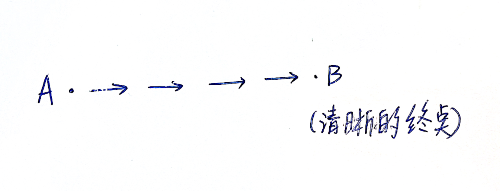
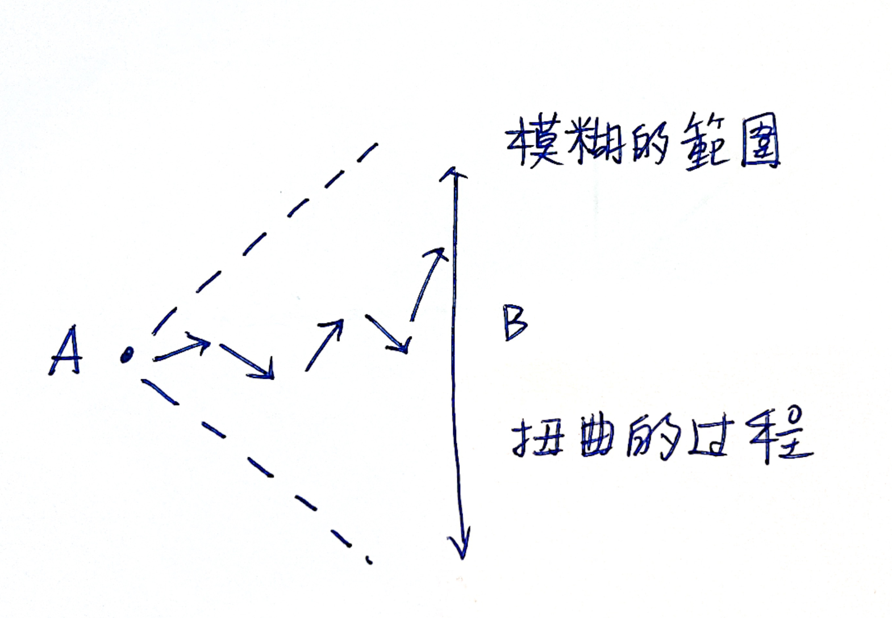
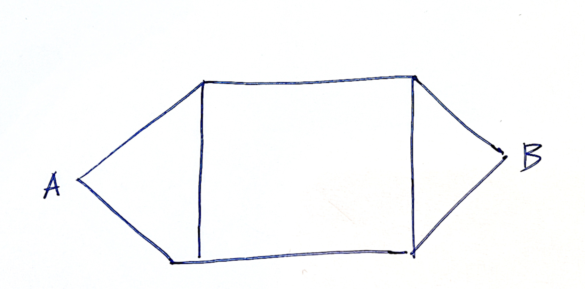
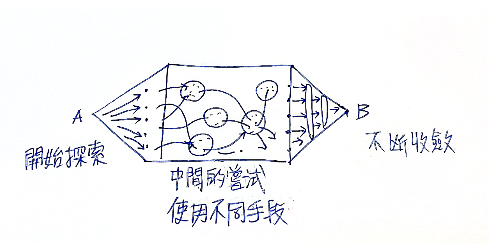
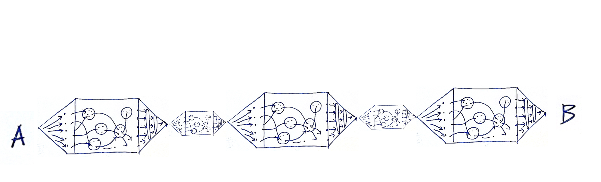
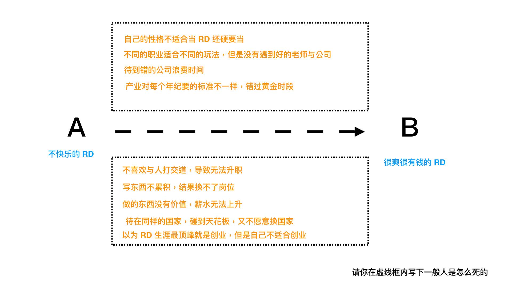
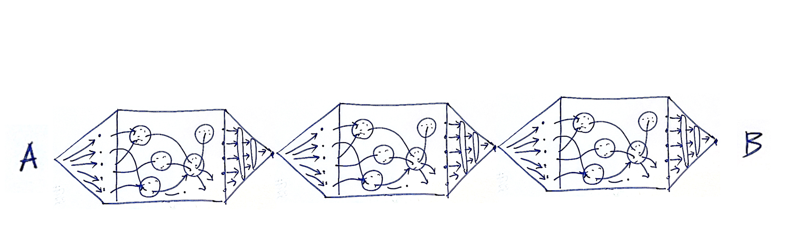
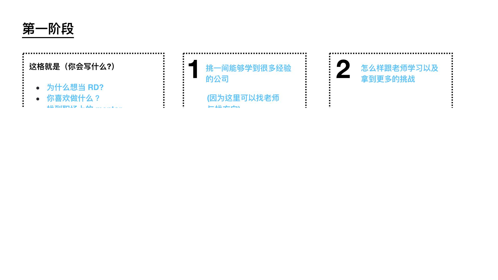

# 第九章 推動點火引擎、將自己的學習旅程化成一場遊戲

你一定會想，講完了遊戲設計原理。接下來我們應該會談在第八章提到的八角動力框架吧。如何從中挑選適合自己的短期、長期動機作為學習強化器。讓我們更跨達到自己的目的地。

很可惜的我並沒有打算先討論這個話題。

因為絕大多數來自學的人˙，絕大多數**動機**都很強。

加動機不是重點，而是**持續力**。

在我寫作這本書時，曾經蒐集了很多坊間對於學習最大的抱怨。諸如：

1. 無法持久，可能學習一兩天，到第三天就沒勁了
2. 日常事務太多無法專心（無法有完整足夠長的時間段學習)
3. 遇到太過困難的學習時（卡關時）探索時間花費過長
4. 無法持續 堅持學習困難
5. 沒有教練指導 沒有評分系統
6. 一開始動機強，持續力不足
7. 有時遇到的課程節奏掌握的很拖沓，課前不知道今天到底要講什麼，上課過程中不知道自己進度到哪，一直聽下去之後發現花了很多時間根本沒有收穫到。
8. 遇到一眼看不懂的東西，常常會退縮。
9. 有些線上課程沒有快轉或逐字檔 節奏又很慢的話會想要關掉
10. 看不到自己顯著的成長，很喪志，沒自信。
11. 學的東西雜亂無章，沒有系統，自己無法統合，也不知道程度到哪，沒辦法像打電動一樣會成癮，或者是看的到經驗值跟等級。
12. 學習無法連貫，很容易被其他事物打斷以至於分心。有一些觀念不理解，以至於後面在講更深入的主題時會無法了解。年紀愈大，學習愈看心情，心情好的時候，會全神貫注。但心情不好的時候，會想轉移焦點。

這些抱怨似乎看似不同，但本質上都是相同的。

### 我是誰、我在哪、我等下要幹嘛？

這些抱怨背後本質上都是在講以下幾件事：

1. 我不知道我的長期目標是什麼
2. 我不知道我的短期目標是什麼
3. 我不知道一小時之後我能夠得到什麼
4. 我不知道接下來十分鐘我能得到什麼
5. 我不知道我能不能在未來5-10鐘內完成一份作業，複製老師的一套動作。
6. 我不知道我是不是自己是不是走在正確的道路上
7. 我現在的進度在哪裡
8. 還有多久才會走完

這幾點可以簡單濃縮為：

1. 我現在進度在哪裡
2. 我現在走的方向正確嗎
3. 還需要多久能完成我的瞬時目標、短期目標、長期目標。

我們更可以濃縮為一句話，在這個遊戲的「座標軸」。

想像一下，朋友如果介紹一個新遊戲，跟你說很好玩。結果你從Steam上購買下載打開來，遊戲一開頭就把你扔在一個霧茫茫的森林裡，根本不知道怎麼繼續。你接下來會怎麼做。

答案是，直接退出刪掉並要求退錢。

一個霧茫茫的森林，就是**大多數人處在一個設計的很爛的課程的感覺**。我不知道為什麼我要在這裡，我到底在哪裡，我等下要幹嘛。

大多數人會覺得學一個自己半途而費，三分鐘熱度，非常有罪惡感。想尋求更強的持久劑。但事實上，這是不太可能的。

因為人類的注意力最長就是這個「三分鐘」。當然這個「三分鐘」不是真的指 3 分鐘（270）秒，而是人類的注意力、短時記憶力，對於學習沉沒時間的忍受度，都有一個最長極限。比如說：

- 影片是 1 分 30 秒。如果一個影片沒有任何重點、爆點，90秒內必定被關掉。（這也是抖音初期的應限制）
- 一個遊戲的回合限制是3-5 分鐘。比如說令人沉迷的文明帝國就是一回合3分鐘，結果玩家常玩著玩著不小心就天亮了。火遍全中國的手遊王者榮耀也是一回合3-5分鐘。很容易就讓人不知不覺一直挑戰下去。
- 一堂線下課程的一小章節，應該是15分鐘。因為人類的短時記憶力，最長只有15分鐘。
- 一堂課下課程的一大章節，應該是45分鐘。因為人類會累。最好是上1小時，休息10-15分鐘，不然學生容易崩潰。
- 一個小套路的學習，最好是1小時，一上午，一天能夠完成。因為成人學習有時間成本問題。
- 一個回家作業的耗時，最好是30分鐘內可以完成。因為成人回家沒有那麼多專注力。

人是追求確定的生物。期待輸入什麼，就得到什麼的成果。同時，對於資源的消耗程度，也有一個心理帳戶硬限制。

可惜不管是學生或老師，往往追求的是「越長越好」，彷彿是越長 C/P 值越高，老師追求放在課程內越多東西，學生追求集中憋氣在自己可以花費的整塊大段時間一次把課上完。

就如同新手去跑馬拉松一樣（不覺得多數學習行為都很像嗎？）。可惜最終都會失敗告場，

因為在學習上，人類本質上追求的就是：

1. 越快學到越好
2. 重複、確定、完成
3. 看到自己有明顯進步
4. 看到自己達到最近的目標

### Points / Badge / Leaderboard

當我們在談到將教育遊戲化時，教授「遊戲化」這堂課的老師，總會告誡參與學習者，勿濫用ＰＢＬ系統。也就是 Points / Badge / LeaderBoard 這三大機制。將教育遊戲化，不要以為單純將 PBL 加進去，就會讓學生學的沉迷、或者是有趣。

其實這句話說的對，也不對。真正的遊戲化過程十分繁複，得從如何設計遊戲基礎玩法，切分關卡，在不同的階段適度引入短期動機與長期動機，一路設計。

但是最根本 PBL 有用且經常被濫用的原因。是因為 PBL 將學習效果「可視化」了。

- 我因為答對問題，得到籌碼1000 分。(Points)
- 我因為最常回答問題，得到「答題王」稱號（Badge）
- 我們整組在全班排行版上，得到分組第二。（LeaderBoard）
- 我通過了考試，得到 LV２的認證

PBL　能夠有效的讓我們知道，我們是誰（程度為何），現在在哪（相對程度），等一下要幹什麼（得到更多的積分、幹掉隔壁組的對手、霸佔排行榜）

能夠非常有效的吸引短期注意力，並且給予非常確定的效果。（雖然這也有一定的副作用，如果你一直都贏，那當然很爽。如果一直都輸，那很有可能會放棄。）

但重點是，懂遊戲化的設計的老師如同鳳毛麟角，你也可能遇不到。所以我們做為學生，最可能做的就是設計自己的ＰＢＬ。

- 讓自己知道自己進度在哪裡
- 在正常情況下，自己的合理學習目標要如何設定
- 一般來說，這樣的學習旅程其他完成者會耗時多久？
- 我如何讓自己的學習成果可視化，讓自己每天都有進步感
- 如何將學習歷程，切成讓我每天的心理/生理帳號/現實可承受消耗。（比如說動森就不會讓玩家無限的玩，也不想要玩家一天之內無限的玩。通常一天之內30-120分鐘就可以做完今天的任務）

讓自己知道：我是誰、我在哪，我等下要幹嘛？

### 燃料推力與星球引力

但如何將遊戲化八角理論應用在自己的動力設計上？

八角動力這套框架用來分析遊戲時，你能看得一個遊戲使用了什麼動機驅使了玩家的行為。但是自己設計遊戲時，卻不知道如何著手。

這也是當初我學習遊戲化應用時最大的障礙。後來經過不斷的拆解人類的動機，我終於搞明白了怎麼使用。其實，八角理論的應用不是看心情抽出來隨機使用。

整個系統應該是火箭（遊戲者）與星球（目標）的關係。

短期目標為燃料推力。長期動機為星球引力。

當然還有最重要的「導航系統」（我是誰，我在哪，我等下要做什麼？）。

如果星球很近（短期目標），燃料噴一下就過去了。根本不用什麼星球引力、導航系統。比如說我們有時候要讓某些人做事，只要給他錢就好了。

但是大多時候，錢不管用。因為目的地太遠，我們要到達目的地，多半時候是在太空飄過去的，這時候就要靠星球間的引力，還有正確的導航系統才能走得到。

如果我們要走一個不算短的旅程，最重要的反而是設計旅行節點、正確的導航方向、利用引力一點一點慢慢拉。燃料只用來短時間噴射修正角度而已。

我們在第二章時，提到大谷翔平的這 64 格計畫圖，現在看起來是不是有點意思了呢？

## 如何設計出自己的遊戲

我們在上一段談到了導航系統的重要性。但問題是怎麼設計出導航系統呢？

而且我們在學習中最常出現的問題，就是走著走著走錯路，然後當中力氣不小心用太多。就放棄了。

更何況，多數的自學，是沒有走過這條路的。更何來設定正確目標、方向、導航系統。讓自己有目標又有成就感。

設計一個英雄之旅理論上看起來厲害。但我要怎麼開始？

## 遊戲是如何被設計出來的？（鉛筆式設計）

讓我們換句話，自己的學習遊戲到底是要如何被設計？

理論上我們有小套路、大套路，短期動機，長期動機，PBL。應該組起來就大功告成。但實際上並非這麼簡單。

因為如果只要容易上手、有強動機、還有有趣設計，就能設計出好玩的遊戲來。那這世界就不會有那麼多爛遊戲了。容易上手只是最基本，但能夠持續玩一個月真是困難。

許多遊戲設計師也覺得遊戲設計也蠻像通靈的。

那麼，遊戲設計有方法嗎？

這個問題其實非常難回答。我翻閱了一百多本遊戲設計書籍，甚至問過不少遊戲設計師。最後才在一本書 Gamestorming 挖到一個關鍵的方法（多數人的回答都像通靈，有的說用心，有的說要有核心玩法，有的說要加入有趣的機制，有的說要有精彩的遊戲劇本）。

Gamestorming 這本書指出了我們一般人在完成一件事，或想指引人家走一條路時，最大的盲點。

就是往往我們會覺得要從 A （起點）走到 B（終點）。

1.  A 與 B　都是一個清晰的點
2. 而且直接可以連過去

這是我們對於未知的預期。但實際上最後你會發現，你以為的 b 點漂來漂去（資料找著找著就矇了）。而且中間的路也不是一直線（會遇到很多岔路，走的歪歪扭扭）。

所以實際上，正常的探索過程應該會是這樣

Ｂ點不是一個點，而是一道模糊的線，而Ａ到Ｂ中間彎彎曲曲的。

所以，一個遊戲的形狀應該是這樣的。像一支雙頭尖的鉛筆。

A是一個起點，B是終點。A出發有一個發散的過程，但到B時逐漸收斂成一個終點。而在這個過程中，有明確的邊界。而玩家是在裡面透過探索，逐漸連節漂浮到對岸的。而且可以是不同姿勢

而且當中的過程，甚至是可以被切細再變成三支鉛筆。

甚至繼續拆細成無數支鉛筆。

## 過橋法

等等，看到這裡，你是否有點眼熟？怎麼類似的結構有在打造超人大腦出現過。（持久寫作篇）

我在這一章講述了如何快速寫完一本書。這一章是比較可惜的章節，因為多數人沒有寫書的需求。但是這個方法同樣也可以用在學習上。

在打造超人大腦一書中，我拿來示範的題目是: 工程師的成長之路。

### STEP1 : 定義起點與終點並且困難之處

1. 定義起點與終點
2. 整理出一般人為何中途失敗了

### STEP1 : 將困難之處，反過來寫變成踏腳石

在前往B的路上，一定困難重重。我們要穿越一條河，一定到處都是暗坑漩渦。一失足就沉沒。

那我們可不可以反過來想，直接把坑填平了，並且架上大墊腳石，是不是反而好過河了。

當我們寫完之後，甚至可以發現這一堆墊腳石，都還可以分成三大類。並且還能夠照順序。

那麼，這是不是就像之前提到的三個鉛筆結構圖。

接著我們再往下拆細

像第一阶段，程序员找工作，第一份是最重要的。主要的重点应该放在第一份工作，如何大量的吸收经验，去决定未来自己想要往哪个方向，并且找到资源。

第二个阶段，则是应该锻炼自己的协作能力，以及自己的精进技巧。

第三个阶段，程序员会迈入不再跟人拼体力青春。而是拼综合技能的阶段。这个阶段需要管理能力以及商业 sense。

你會發現，這四張紙，可以是老程序員教給小程序的一章生涯地圖，也可以是如果你想轉行變成程序員，未來按圖索驥找書搜資訊的地圖。

這每一個小標題都可以是一個流程（小套路）。每一個大標題都是一個階段（大套路）。

到此，我們在第八章、第九章的關卡設計就完成了。老師教與自學，其實就差別在於有沒有人給你現成的答案。

如果找不到答案。你也可以按照第七章的

1. **XX 是什麼？**
2. **為何重要？**
3. **如何做到？**
4. **如何快10倍做到？**

循環做到。

## 菜單學習法

讀者應該會注意到，這本書裡面我引用了大量作菜的例子來舉例。原因有幾：

1. 做菜是生活普遍中的場景，幾乎人人都能明白我的比喻
2. 做一道菜不需要先學大道理，模仿 / 輸入 / 輸出，即可做到。好不好吃再說。
3. 肚子餓了你不會管那麼多大道理，菜倒進去開始烹調就好，煮出來可以吃就好。
4. 可以吃飽而且不小心好吃就有滿滿成就感

我常聽很多人抱怨，自己生活撥不出來時間學習。

事實上我覺得反而是大家時間太多太凡爾賽太愛面子了，才會去學習不可能的菜。

比如說初學者挑戰學習王剛師傅的寶塔肉。

王剛師傅這道寶塔肉非常厲害。但是做寶塔肉不僅廚具講究（需要廚用大鍋、專用寶塔）、調味料難以準備齊全、更重要的是這道菜背後是要練幾年的刀工！！！！

我自己在練技能時，通常用的就是很簡單的家常菜練功法。

1. 首先明白自己喜歡吃什麼。想吃什麼。自己目前微弱的能力能做到什麼。
2. 然後首先去找作自己可以常吃不會膩，吃可以馬上吃飽的幾樣菜譜。
3. 先學做菜就是不要管順序模仿老師示範倒進去最後煮得出來能吃就好。
4. 後面被自己整到了，再開始知道，蔥蒜要先暴香，怎麼樣鹽不會放太多，怎麼樣不會煮焦。

這當中就可以慢慢領悟

1. 菜的順序要怎麼做？
2. 裡面最重要的調味料是什麼？
3. 有沒有什麼快速出爐的方法？
4. 如何可以20分鐘同時做四個菜？
5. 家裡哪些調味料是冰箱先備起來的
6. 什麼醬料是可以一罐打天下的。每道菜加了都好吃。

按照這樣的想法，去把你想解決的問題，拆到最小可做的菜單。按照做菜的想法與心態，備料烹調。各種目標就容易完成而且很容易有成就感。
