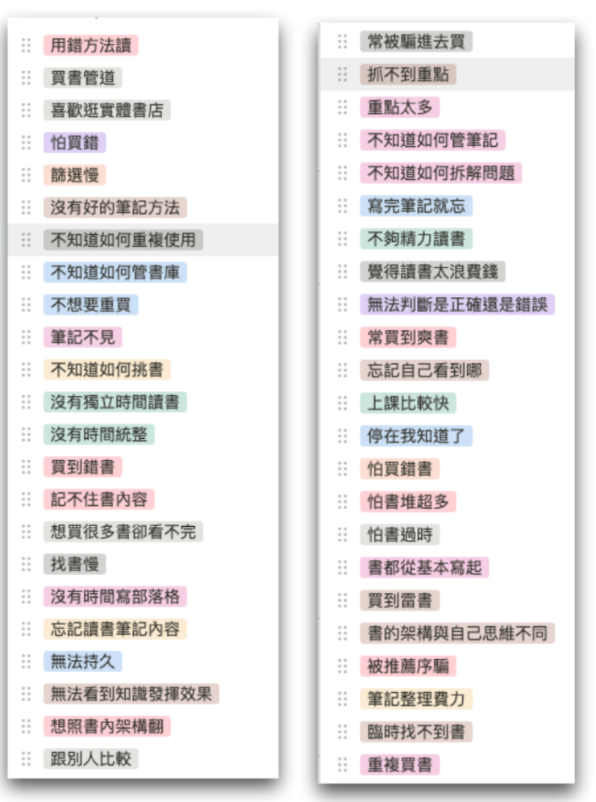
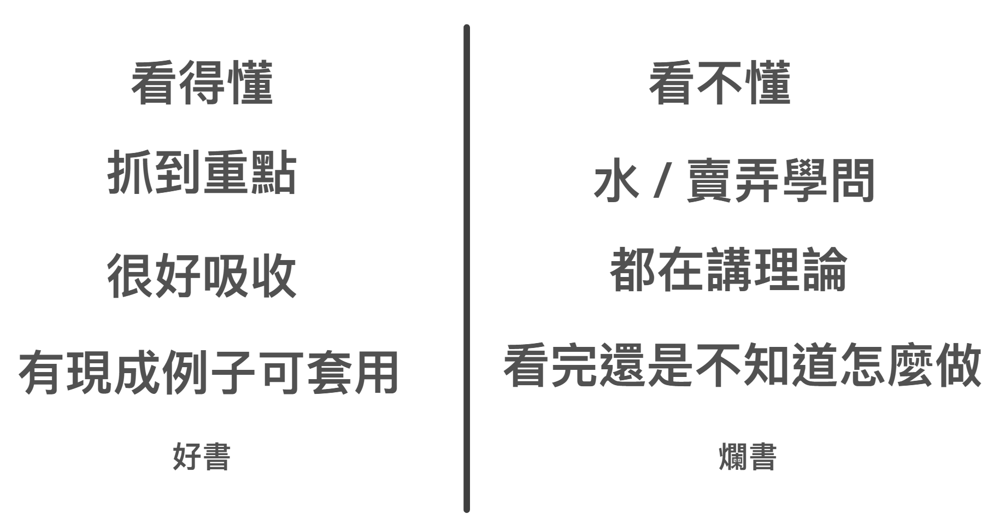

# 讀書篇（1) - 打造超人讀書能力

寫到第十章，本書理論上應該就完結了。

這本書的主軸就是重新撿回一套自己天生就有的學習流程。

教大家科學的

*  切碎自己煩惱
*  重新設定小目標大目標
*  刻意練習、上癮
*  將自己推進正循環。

如果你能將自己的學習流程，按照打造超人學習這樣的方法重新解構，跑一遍，一定會產生突飛猛進式的量變與質變。

其實一般人讀到這裡也就夠了。

不過，我的朋友在讀完這一本書的初稿後，很變態的跟我提出了一些進階的要求。他說，你是重新發明了一套學習方法。但是你還有一些主題在這本書沒寫出來阿？

* 如何將這套理論、流程應用在學習的實際場景：「讀書」、「做筆記」、「上課」上。
* 可不可以示範跟我們說你是如何自學的。
* 這套方法也可以套用在編程以及學語言上嗎？

為了好人做到底。所以我乾脆把原本一部可以寫打造超人學習2的內容，當作「應用篇」乾脆也加碼直接編進這本書裡面。

所謂加碼環節也就是可看可不看。不看的話不影響對流程的理解。看的話可以提高你在每個步驟的執行效率，以及在各個不同領域的拆解速度。

在本書的後面章節，我們會接著談論以下主題：

* 如何讀書
* 如何做筆記
* 如何上課
* 如何自學
* 如何自學編程
* 如何自學語言

### 高效讀書是學習的開始

在自學路上，最常讓大家踢到石頭的主題，無非是「讀書」這個環節。原因很簡單，因為大家學習能夠接觸最快最便宜的管道，就是自己看「書」。

書甚至是一個可以穿越時空、地理限制最好的知識傳遞渠道。

然而，雖然這個媒介雖然降低了知識「到手」的難度，但「吃進去」的難度卻沒有很低。

甚至「讀書」對許多人來說，就是學習路上最大的門檻。因為一般人讀完一本書，至少就需要幾個小時，還不一定記得起來裡面的內容，更何況做出筆記。

當初，「打造超人」系列的起點「打造超人大腦」，甚至就是裡面的一套「極速讀書法」，強調「30 分鐘裡面高效能讀完一本書，並做完筆記」，才開始爆紅起來。

極速讀書法提出的核心作法是，

1. 事先先列出自己想在這本書得到的問題解答，作為目標
2. 讀書時只專注在找到解答，其他不相關的可直接略過
3. 專注只在筆記寫下揀取有效的16個解答
4. 在讀完之後立刻整理成三個重點，並複送一次重點給朋友聽，加強自己的長期記憶

這看來簡單的方法，當中卻運用了許多人類的大腦運作原則，所以十分有效。

然而，在這個新讀書方法推出之後，我又陸陸續續接到讀者一些相關的問題。發現讀書問題並不是只有高效讀完並寫筆記的需求這麼單純。

甚至，我後來對讀友群做了一輪大調查，才發現「讀書」這個問題之多，令人瞠目結舌。「速度」甚至只是其中的一小環。

- 買了亂放忘記看，找不到書重複買，讀書的時候看感覺，想讀的類別不在手邊，不然就要固定地方才能看書
- 不確定怎麼提高找到好書的機率、讀書筆記平時都會手寫但想要電子化
  - 1. 怕買到爛書
  2. 不知道要怎麼找書
  3. 竟然連好朋友寫推薦序的書拿過來一看也有機會遇到很水的書, 對於找書的部分覺得迷惘
- 有時從書名或線上的內容簡介，買到與期待有落差的書籍。最近買「服務設計」相關的書，就覺得踩雷。
- 書籍邏輯架構與自己的思維不同，讀起來卡卡。
- 網路書評不準怕浪費錢/無電子讀本怕買越多越佔空間/買了沒時間看堆著佔空間/買了過了幾年就過時了/書本都從基本開始寫起
- 買書找書讀書感覺學習速度太慢，直接去上大神的課快多了
- 我看書的時間是上下班通勤的時候，手邊沒有筆紙所以很少做讀書筆記
- 找書都是看FB朋友說哪本書好，照著買一輪，或是最近有甚麼暢銷書買來看一看，學到的東西僅停留在~喔我知道了~的階段
- 平常看書的時間比較片段，所以有時候一本書可能分快十次看完，但是書中有些概念是前後連貫的，分太多次看完就會導致後來看的時候忘記前面看過什麼內容，導致要常常往前翻複習之前幾次看過了什麼，但是這樣又會導致看書的效率低落。除了撥出一段長一點的時間去閱讀之外，不知道還有沒有其他辦法解決這個問題。
- 讀書和學習新知識、課程的時候，實力不足沒辦法判斷正確內容或寫書者的實力、更不可能有背景知識其他背景知識、所以非常繞圈子、高耗能低成效，簡單來說常常困於「用未知解釋未知」的窮途。
- 買書學習就是希望實際進步，問題是沒有人畫地圖（學習路徑地圖）要看到實際的成長和成就需要一個一個階梯和小測驗，可是很多書是「知識佈道」（覺得這個形容非常貼切）獲得精神上滿足，實際上讀完唸完還是沒辦法清楚輸出。覺得蠻尷尬的。
- 如何分配精力管理，不知道學得夠不夠，或是不是太多了，很多東西都學無止盡，不知道哪裡停下來，但想學多又會太累．
- 為了興趣學習時很開心，但想到花時間學這些又不賺錢，好像有點浪費．
- 為了生存學習技能，覺得充實但有時候沒那麼有趣
- 筆記寫完就是寫完，不太能累積
- 讀書時雖然會從目錄找尋自己感興趣或是可能是問題的答案去看，但看完很容易抓不到重點，或者是重點太多，貪心想要全部學起來的情況下往往到到後面什麼都沒學起來。
- 太多書讀不完，不曉得應該從那邊看起。
- 讀書筆記有各種格式、筆記本、空白紙、word，散落在各處。
- 目前想要解決的問題過於巨大，無法有效的拆解，找到真正的問題再針對真正的問題找到答案。
- 買書的時候常常會看到文案寫很好就買了。找書方面，用Amazon 找都會推薦相似性很高的書籍，會膩。另外想要找不同領域的書來看，但是不知道怎麼評估書的質量。
- 書名跟我要的內容不一，感覺作者在繞來繞去，就看不下去，
- 明明寫得是中文，我卻看不懂，又看不下去了
- 書看完卻記得不多，覺得自己得失智症
- 不知道從何買起？該買入門書？會不會太淺？讀起來被人笑？
- 什麼書才是好書？好的定義是什麼？好讀 好懂 易吸收 有內容？
- 習慣只在自己熟悉的介面或平台買書？ ex:博客來 書籍的來源被限制
- 碎片式學習 因為工作的關係 讀書會一直被斷 除非利用凌晨時間來讀書比較不容易被打斷
筆記散紀錄在不同app 要找資料時 找不到/忘記紀錄在哪？
- 沒時間或懶得做整理
- 沒做歸納或統整 內化成自己的東西

我將這些問題收集起來，打上 TAG 歸納以後

發現大家的問題可以簡化到以下三個主題：

* 如何找
* 如何篩
* 如何吸收

## 1. 提升找到好書的機率

打造超人讀書能力，一個關鍵點就是要提升讀書內容的質量。但問題來了，買到好書真是可遇不可求的事。

不少朋友的糾結點就在於，常常在市場上買到爛書，但是又要花時間讀進去做筆記才知道這本書是不是好的。

能否有一個辦法提升買到好書的機率呢？能在第一輪就買到好書嗎？

### 三輪買書法

我對這件事的答案比較奇怪，我買過數千本書回家之後的真實經驗是，「你絕對沒辦法在第一輪買到夠多好書。」

為什麼會是這樣的結論呢？

這要從知識面（閱讀者）與書本身含金量談起。兩者都有關係。

一般來說，我們在第一輪時，因為各種因素，最後會買到的書通常是這幾種書。

- 標題黨（被封面標題、書封、推薦序騙進來）
- 水書（整本書都在泛泛而談，有用的內容不過兩句）
- 難書（別人說這本書很棒，但自己卻看不懂）
- 錯書（打開亂講一通，方向完全錯誤）
- 剛好可以看得懂的書　（自己看得懂，覺得有些用處的書）

如果你有老是買到錯書的機率是很正常的。就我本身的經驗，甚至可以很準確的跟你分享，在第一輪就算買到剛好可以看的懂而且可以用的書。大概機率就只有20%。

這裡面有各種原因。有讀者自己程度不夠，也有書真的很水。也有讀者本來覺得自己可以靠一本就精通。也有看的懂不會用，需要組多本來看。

總之第一輪買到的書大概勝率就只有20％，也就是買20本頂多有用的書就是4-6本。

一般人通常到這裡，就會停了。以為自己挑書能力太差或者領域太難。

其實都不是，而是你不知道書籍命中率的計算方法與挑書選書看書的最佳實踐而已。

我在買書時，勝率其實也不高。但朋友往往覺得我老是可以買到神書。那是因為，我真的買的書足夠大量。並且還有一套挑書方法。

而且，對我來說，第一輪的書，並不是要拿來「看」的。而是要拿來做「領域過濾篩選」用的。

透過大量的同時翻閱，找到

- 這門領域的真正關鍵
- 當中可能的幾個模糊原則
- 大家都在談的方法流程

然後透過這些資訊，去找第二輪的書。是的，你沒看錯，書要買第二輪。不只要買到第二輪，還要買到第三輪。

你在第一輪買到那麼多「無用之書」其實不用氣餒。其實換個角度，這些書也很有用處

- 標題黨（被封面標題、書封、推薦序騙進來）→ 只留下封面標題、書封，書本體丟掉。
- 水書（整本書都在泛泛而談，有用的內容不過兩句）→ 用筆記抄下裡面唯一有用的兩三句話。
- 難書（別人說這本書很棒，但自己卻看不懂）→ 暫時留著以後再看
- 錯書（打開亂講一通，方向完全錯誤）→ 扔掉

其實，這些書不是買錯。而是有用的資訊錯置而已。如果你會被標題與書封騙進來，那表示標題與書封一定是走到潛意識你認為的正確方向。你才會買。所以你應該留的不是本體，而是封面。

再來，有用的書並不是指整本書都要是超級乾貨。而是當中有幾句話對你起到作用，那這本書也能叫做有用的書。甚至，我還曾經買過一本書，裡面只有前言的一句話對我有用，而整本書完全沒用的奇杷書。但是，我真的就只要那句話就夠了！

### 第二輪買書

接著，你再按照第一輪篩書的結論，再去買第二輪的書。准度就會提高很多。

因為這時候通常你已經從「本來什麼都不知道的人」提升到「大概知道領域重要資訊」是什麼的人了。

這時候你再去看 Amazon 的相關推薦。瞬間就會發現很多被你遺漏的書。這時候我的原則是，在書籍介紹頁，有擦到邊（由第一輪整理到的資訊判斷）就收。

別擔心，這時候准率就不會像第一輪一樣低到20％那麼可怕了。這一輪買書籍中的機率就會真正提高到60-70％。通常我在這輪買10本會中到7本。

這裡有一些買書小訣竅，通常，我也會去加買在第一輪找到「正確的書」的同作者相關的書，准度會很高。這是因為同一個作者，宇宙觀通常是相近的，甚至會一直在進化。所以買同作者的書，命中率會非常高。

再來，也可以去參考書評網站「豆瓣」或類似的書評網站。翻找底下的留言，有時候你可以順藤摸瓜看，別人也看了什麼書。或者在評論裡面也推薦了什麼書。

### 如何提升第一輪買書的命中率

讀到這裡，可能會有讀者想多問一些如何提升第一輪書籍命中率的訣竅。

其實還是有方法的。第一輪書籍命中率之所以低，是有幾個原因的，但大多數是讀者的原因：

- 想買一本就解決問題，所以反倒買到對自己太難的書
- 有時候領域重要的書，為了要讓初學者看懂，其實寫的很平易近人，但因為看起來實在太簡單了。反而被初學者直接略過，以為太簡單不需要買。
- 初學者多半想知道的是理論，覺得作法不重要，所以對於「怎樣做」的書通通跳過。

一般來說。我買第一輪書的獨家秘訣是：

我只鎖定這些關鍵字

- 圖解
- 兒童
- 新手
- 十倍
- 超人
- 零基礎
- 百科

在這些書裡面，通常會整理很多有用的流程，且深入淺出。這些書，通常會被一般的讀者忽略。

我通常到第三輪找書時，回頭再重新翻一遍時，常常都發現真理就躺在這些看似「太簡單」的書裡面。

### 第三輪買書

在第二輪的買書時。我通常已經可以按照第二輪買到的書，將

- 領域關鍵核
- 五大核心
- 1-3條可行大作法（範例、步驟）

明確的梳理筆記出來了。

這時候，我會去第二輪找到的書，去看看那些作者有沒有提到其他作者的書，再深入買一遍。

這是為什麼呢？當中的原理是，其實每一本書都是作者自己看完許多書的綜合「排泄物」，一般來說，書籍很少有原創一說，多半是書籍作者讀過很多書，做過相當研究的融會貫通，再將自己的理論重新融會成自己的說法與角度。所以很少會有出處來源。

但如果一旦書中明確標出了出處來源，那就表示這本書受了該原始作者，很大的啟發，如果你往上找，通常會發現源頭的資訊純度更大。

這才是真正的「推薦」。

而通常在這一輪，命中率通常會高達八成。買5本中4本。

### 買到一本好書的機率是 50％

如果我們再將這三輪買書的數字，加總起來，你會發現，其實我們買到「正確」的書，概率也差不多就是50％而已。

這難怪你有老是買到爛書的感覺。因為買不中的概率是真的蠻高的。但是只是很多人並不知道，買書要買到三層以上。當你透過這三層買書法，就可以很準確的把這個領域絕大部分的關鍵知識都蒐集到。

另外，我發現，許多人在買書時有一些奇怪的迷思。

比如說，新書 = 好書。這其實並不是必然的。因為按照每一本書都是作者的排泄物來說。其實有時候，新書反而是濃度相對於較稀的書。我在看一些比較古老領域的書，就有發現，神書往往是幾十年前被出版且絕版的。

相對於近代反而沒有什麼寫的比較好的書目。

又或者說，有些人會疑惑。明明市面上大家都推薦同一本書。自己去買了書，卻發現這本書寫的很水，且重要理論錯誤百出。甚至開始懷疑，到底是自己錯還是書錯。

這是因為按照德雷福斯模型，市面上最多的是高級新手，同樣的市面上最多的也是高級新手寫的書。最多人推薦的書不代表是「正確」的書，甚至是「正確的理論、作法」。而是那些不懂的大眾，「讀起來感覺很厲害，不明覺厲」的書。

甚至我讀書找書到最後，發現那些超級好書，多半有兩個現象「冷門且絕版」、「看起來太簡單而被忽略」。

我們當然都想一開始就找到神書。但我要說這其實都是有個過程的。書也不是說你想第一次找到就找到。

但關鍵是我們要如何建立起一套篩書找書的辦法。而且要認真篩到第三輪。

其實不需覺得麻煩。看完下一章，你更會發現多輪篩書選書的重要性。
