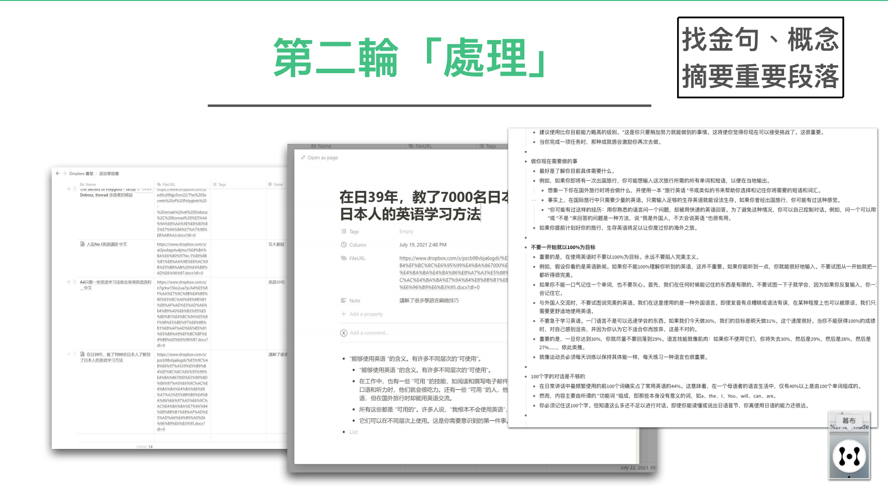
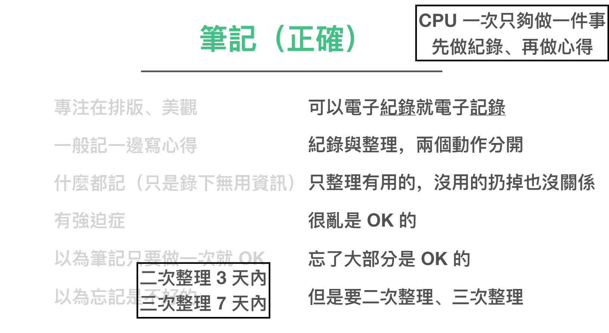

# 讀書篇 (3) 做出真正能記住內容的讀書筆記

這一章我們要來談談做筆記的部分。

一直以來，很多人就為筆記所困。主要癥結點也大多數相同

- 記筆記容易累
- 不知道重點要不要都記
- 重點要記在書上 還是筆記本上
- 筆記散亂在各地，也分為很多種形式，如何收納整理
- 寫的筆記不美觀，但做的美觀好像也記不住
- 寫完筆記過一陣子就忘記
- 書上重點太多要記，很快就累了

所以市面上不止提升讀書能力的書很多，關於提升筆記的書也很多。那麼對於筆記這部分，大家真正的問題到底在哪裡呢？

這裡我想要提出一章比較圖。我認為真正關鍵癥結點，不在筆記這個主題上。

而是在學習心態上。

從小，我們受到的教育，幾乎都是被動教育。在學校上課，你不能質疑老師所說，甚至還得預設老師都對的。拼命記住不知道是正確的還是錯誤的資訊，甚至還用低效的方式吸收。

而這種學習習慣也被帶入讀書這件事裡面。

很多人之所以覺得讀書很累，是因為在看書時，沒有預設自己想對這個領域提出什麼問題，精確的來說，自己在搜尋什麼資訊，甚至更假設書上的資訊全是對的（但看著看著又覺得很怪）。更不要說很多人讀書的動作甚至是內心一個字一個字默唸（這又更消耗能量的）。

我們把這段話再仔細細拆，你就會發現讀書做筆記本身是幾個連續動作

1. 將圖像在大腦轉成聲音，聲音再轉碼成能夠理解的資訊
2. 判斷這是不是該被抄下來的資訊
3. 手動抄寫複製書上的資訊
4. 針對書上的資訊，產生心得，再手寫一遍

如果我們將讀書寫筆記這件事，再比喻成將剛洗好的衣服拿進房間整理，收納成衣櫃。

這等於你要將洗衣籃的衣服先抽出一件，如果是衣服，你要把他抖開，再折起來，然後再放進衣服格子裡。接下來，你再抽出一雙襪子，把襪子拉平，再兩雙套起來，再放進衣櫃的襪子格子。再接下來，再抽出一件內褲，把內褲翻成正面，對折起來，再放進衣櫃的內褲格子裡面。。。好了，我不再繼續敘述下去了。

重點是，正常人沒有人這樣拿一件折一件收一件，這樣大概連續四件，可能就沒有力氣了！

正常人會做的順序，可能是會先把洗好的衣服先倒出來在床上，先粗分類，先折衣服褲子、再折內褲、接著套襪子。然後再一疊一疊收進衣櫃裡面。

為什麼呢？因為這樣做很節省力氣，也不用彎腰站起來，也不用走來走去，也不用不同動作一直多工切來切去。

回頭來看，我們讀書記筆記的連續行為看起來自然，實際上

1. 將圖像在大腦轉成聲音，聲音再轉碼成能夠理解的資訊
2. 判斷這是不是該被抄下來的資訊
3. 手動抄寫複製書上的資訊
4. 針對書上的資訊，產生心得，再手寫一遍

這四件都是不同的事，大腦切來切去非常耗費力氣。所以大多數人讀完一本書（等於折完一桶綜合的新衣服），就沒有力氣了。

如果你剛剛覺得我的三層篩選法怪、耗工。現在回頭看折衣服的例子，你可能會發現，其實這才是比較省力的方法。

因為我一次只要專心做一件事情就好。比如說快速歸納這本是要看的書、不要看的書。只從裡面挑出自己有興趣的資訊，其餘全扔掉就好。

而我也是因為用這套三層整理法，到最後，我讀到的都是自己喜歡且有用的資訊，當然會吃得很開心！

許多人總以為我有一套方法克服吃土的恐懼與負擔，事實上我說了我從不吃土！

### 如何做第一層筆記

接下來我們來談談如何做第一層筆記。

其實第一層筆記與第一層篩書法是差不多的。我基本上是用兩種不同的工具。

a) Notion 閱讀清單整理

我用一個 Notion 表格記錄我買過哪些書，上面只寫一句話讀後感，上面標註之後有空要對這本書，進行怎麼樣的處理。

2) 一本 A4筆記本作為索引筆記

然後準備一本A4筆記，記下零散的筆記。而這本筆記記錄方式也不複雜。只是像是日記一般、我寫上時間，裡面摘抄一些金句，或零碎的感想、感覺而已。

你可能會覺得這樣的筆記太簡單。是的，就是要這麼簡單。因為我的目的也不是拿來吸收的，而是將這本筆記當暫存箱。

通常讀完書之後，我們人類就算把內容忘光了。但都還是會記得大概在哪個月有讀過哪一本書，所以這本筆記只是要讓自己大腦容易回來按日找「相關內容」而已。

第一層筆記如果挪移到蔬果模型。做的動作就是挑水果、去皮、放冰箱而已。

## 如何做第二層筆記

而第二層筆記，就是我剛剛在第二輪整理法當中提到的金句摘錄。

而金句摘錄就是切塊、打汁。但也是暫時放冰箱。

為什麼我們要做二層筆記呢？這是因為絕大多數人都卡在「如何做筆記」這一塊。最常見的問題就是：

不知道要記什麼。甚至記著記著就累了。結果記完沒有力氣整理，然後最後就忘記內容了。

但事實上，筆記要細分，是兩塊動作，一塊是「記錄資訊」、一塊是「整理心得」。大腦的力氣只夠一次作一件事情。如果同時做兩件事情，容易就當場沒力氣了。

所以我們要做的是將「記錄」與「整理心得」分開兩個動作做。而記錄也不需要太執著都用手抄。

過去我曾經在「打造超人大腦」裡面介紹極速讀書法這個方法。原理就是帶著問題去找關鍵字，然後快速找完關鍵字後，當場寫出三句話作為心得，之後再複述給朋友聽。

現在我更懶了，我不用手寫。而改用電子摘抄金句。好處是有時候看到很好的理論，但也需要附上例子解釋，用電子摘抄的方式，就可以快速保存。

這樣能夠節省自己非常多力氣。因為重點是要「省力」的摘錄起來。一旦省力，而且能夠在短時間「能」完成，大腦通常就願意一直做下去。

當然，這樣摘抄的結果也不是很美觀，甚至很亂。這也沒關係。只要你在短時間整理分類，寫成自己的心得，大腦通常就可以記得非常牢。

### 如何做第三層筆記

接下來我們就要進入到第三層筆記。

而第三層筆記我還分成小便與大便兩種。

a) 小便

小便就是通常我在摘完一些書金句之後，過幾天有感而發，便會在 FB上發布一點簡短綜合心得。這些心得通常簡短隨性。但是分享完以後，反而自己記得更牢。

b) 大便

大便就是更進一步的整理整套的實際作法、套路。或者做成 PPT。

比如說這份「打造超人讀書能力」方法論就是我的「大便」。

我將整個作法，整理成一套新的系統、方法。

這樣的好處是我能將流程順過一遍，並且下次做的時候可以快上好幾倍。甚至越來越熟，成為肌肉記憶。
