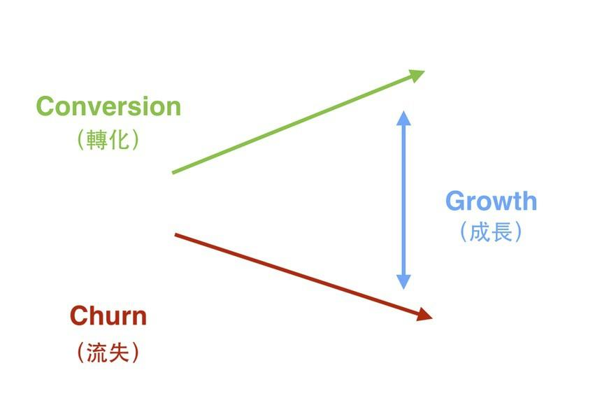
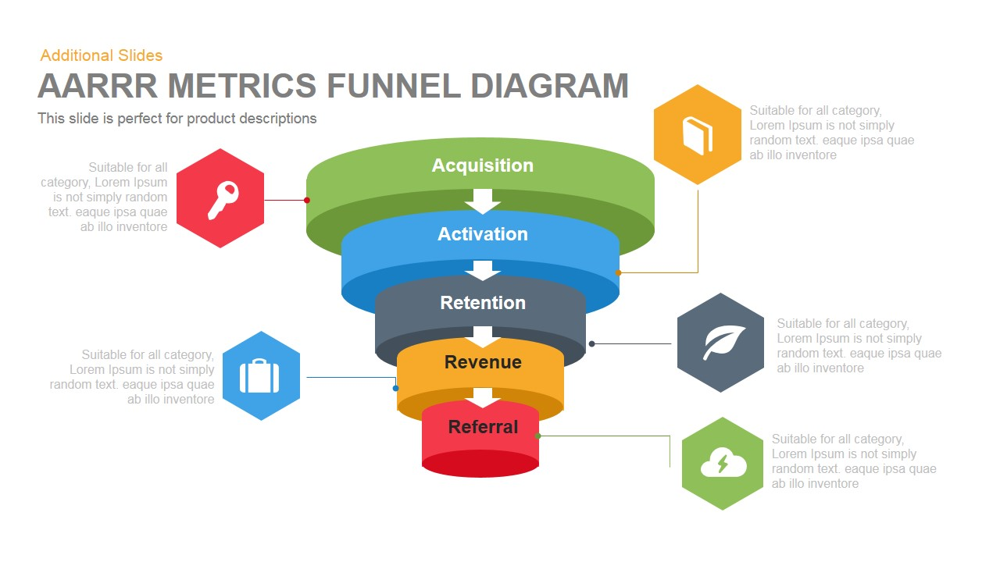
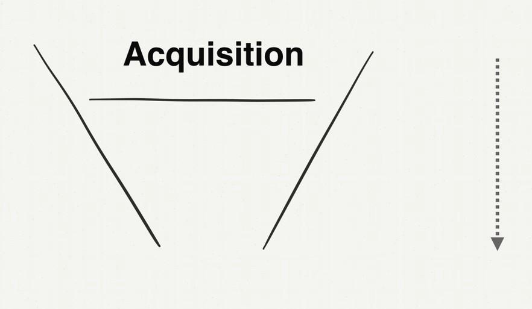

# 如何自學會一門學問

我們前面主要談了幾個主題：向老師學框架、從老師講授的內容自己整理重點。

但是生活中並沒有那麼多好老師，又或者是那些好老師，與你時間、地點永不重合，你這輩子沒機會上到他們的課。

又或者，這門學問技術太新，框架技術真實存在，但是可能到處散落在各領域。從各個來源（書、課程、文章）學習整理困難，感覺範圍無限大怎麼辦？

有沒有什麼高效的方法。事實上還真的有，我就是靠著這套自學框架拿下多門領域的。

英文裡的自學，實際上的英文詞不是 "Self-Learning"，而是 "Self-Taught"（自教）

這裡我要教會大家的就是一套「如何教會自己」的框架。

## 打造自己的「代數習題冊」

2015 年，我在台灣有一門課 "Intro to Growth Hack" 在非常火紅。Growth Hack 這個詞翻成中文，叫增長黑客。是一門在網上用各種技術工具實現業績增長的法門。因為這門課非常的新，當時在中文世界裡沒有太多材料，但又是一門大家趨之若鶩的技術。

2015 正值我當年從美國離職回台灣契機。技術圈朋友知道我在美國時有涉獵這門技術，希望作個分享。沒想到這個課堂就被擠爆了。

原本第一個版本是只針對技術圈朋友分享的。專有名詞很多。

後來在分享一兩場之後，有個朋友問我，能不能將這門技術也改版成一般人也聽得懂秒懂的課程，我試著嘗試做了一個給一般人的ˊ版本。沒想到從此教學之路就此點燃...。

因為當時這門學問又新又熱門，而且當時我的這門課程又讓人秒懂。即便當時我只懂講述法，但也抵擋不了大家的熱情。

最終這門課因為太火，一個月我得賣兩次門票，一場收100人。每次放票在數分鐘之內就被秒殺。半年之內聽過這場演講的人就足足有1500人次。

最後這本書還在一年後變成了一本書 "Growth Hack 這樣做"，而這本書出版沒多久之後，就拿下了金書獎。

為什麼我能夠在短時間（1-2年）把這門新學問研究的透徹又能夠講的淺顯易懂呢？關鍵就在於我的拆題方法與筆記術。

在我的心目中，這個課跟我之前在大學寫的「代數習題冊」（讓全班幾什個同學代數考100分的攻略本）沒兩樣。

早在 2013 年，我就在網上看到 Growth Hack 這個詞了。也想學習，但是當時網上針對這門學問，根本找不到一本書有辦法進行系統學習。翻來翻去都是一篇一篇語焉不詳的英文文章。即便當時有一些行銷人士，做了 Growth Hack 的網課，我也覺得品質很爛，根本沒有回答到我內心想要知道的問題。

於是身為一個工程師。就打算自己研究這門學問。

畢竟，多數野生程序員，幾乎都是自學成才學會編程的。而且編程世界絕大多數問題，很多都是嶄新且實時發展並沒有太多書籍的。我們多半都也是藉由一篇一篇的文章，粹取重點，反覆實做，應用在日常工作中累積出能力的。

在打造超人大腦這本書裡面，我也分享我怎麼從零學財報分析這門課的過程。這本書，我會利用 Growth Hack 這個主題，再演示一遍。

方法步驟是：

### **Step 1：寫下你對這個領域所有的好奇與困惑點(什麼是？與為什麼這很重要？)**

當時，最原始基本的第1個問題，就是「Growth 到底是什麼？」

我找了很多基本的資料，交叉重疊看。在 Stanford 的 2014 版 How to Start a Startup 創業課裡面，聽到課程談到了 Growth 最基礎的概念。（也是身為新手的我，我覺得最合理最畫龍點睛的解釋）

> Conversion（轉化） - Churn（流失）=Growth（成長）

指出了增長 Growth 其實並非是單指業績增長，而是指改進兩個方向：

1. 增進轉換率（促進陌生客人下單率）
2. 降低流失率（降低客人流失）

這個解釋我非常能接受。因為我本來以為 Growth 的字面意思就是增長，沒想到也要降低流失率也是重點。

接下來，我對這門領域的第2個問題，就是那「Growth Hack 到底是什麼」？

我在維基百科上找到了答案：

> Growth Hack（成長駭客）根據Wikipedia（維基百科）上的定義，可以簡單翻譯如下：「技術創業型團隊，通過數據分析和量化指標，來推廣產品時所使用的一種市場營運技術」。

用白話文翻譯，就是

> 在網上做行銷很難，不像實體店鋪一樣，可以實體拉攏客戶，可以看到客戶逛商品的反應，為什麼不想挑了離開走人，也能追問。但是在網上開店，這些事情都做不到，所以我們要用技術手段去監測客戶行為，在客戶有疑問時幫助他能夠找到想買的商品，解決來店時就有的疑惑。也能偵測自己店鋪上有什麼跳出（導致客戶離開）的問題。

也就是平日在店裡面做生意相對比較容易，客人買不買你很快知道，也有辦法當場處理原因。但開一個網店，這些動作就非常困難。我們需要學習一門技術能夠應用在網店上，監視銷售業績，而且不管是增進業績或者是降低客人流失都要能夠自動化，並且大規模部屬。

### **Step 2：找到最常出現的關鍵字或場景（這表示這是這門學問的關鍵骨幹）**

圍繞著 Growth Hack 去搜尋，有一組詞 AARRR 一直不斷的出現。

於是我去查了 **「AARRR 到底是什麼？」**

我發現 AARRR 的意思是指顧客消費生命週期的五個階段：

> Acquisition（用戶獲取）Activation (用戶激活）Retention（用戶留存）Revenue（擴大營收）Referral（推薦使用）

接著，下一個問題就是，**為什麼知道「AARRR」這麼重要？**

我看了很多文章以後，發現了原來我們一般做行銷時，原本對 AARRR 的想像是這樣，以為花大錢灑了廣告費，客戶就會進來：

但實際做生意時，會發生這樣的事。花了大錢打廣告，客戶卻不買單，也沒有複購率：

所以我們才要花時間去改善這個問題，而 Growth Hack 就是在網站上改善這個問題的技術。

問題來了。**我們要如何做到？**

### **Step 3：XX 是什麼？為何重要？如何做到？如何快10倍做到？**

所以接下來，我針對 AARRR 這五個環節，又各自提出了相同的問題循環：

### **Acquisition**

- 什麼是「Acquisition」？
- 為什麼「Acquisition」很重要？
- 如何做「Acquisition」？
- 如何比第一次做「Acquisition」更快上很多倍？

### **Activation**

- 什麼是「Activation」？
- 為什麼「Activation」很重要？
- 如何做「Activation」？
- 如何比第一次做「Activation」更快上很多倍？

### **Retention**

- 什麼是「Retention」？
- 為什麼「Retention」很重要？
- 如何做「Retention」？
- 如何比第一次做「Retention」更快上很多倍？

### **Revenue**

- 什麼是「Revenue」？
- 為什麼「Revenue」很重要？
- 如何做「Revenue」？
- 如何比第一次做「Revenue」更快上很多倍？

### **Referral**

- 什麼是「Referral」？
- 為什麼「Referral」很重要？
- 如何做「Referral」？
- 如何比第一次做「Referral」更快上很多倍？

## **Step 3：太難的主題先跳過**

我在網上經過一番搜索與研究之後。發現了

「Acquisition」與 「Revenue」這兩個主題非常難簡單的研究與總結。

前者「Acquisition」涉及到各個廣告渠道的特性與投放。後者「Revenue」涉及到價格定位設計。

都是超級大的學問。鑽研下去我就迷路了。

於是我直接放棄。先去鑽研有限大的主題：

- Activation (用戶激活）
- Retention （用戶留存）
- Referral（推薦使用）

說是有限大，其實這三個主題也很不小。

只是這三個主題，有明確的範圍、系統化工具、方法論。

再經過一番搜尋與研究以後，我發現：

- Activation (用戶激活），我可以用 Landing Page 解決
- Retention （用戶留存），本質上我可以用 Onboarding 這個概念解決
- Referral（推薦使用），可以用 NPS 這個工具 Debug 客戶滿意度與推薦指數。

搞定這三個主題，整個 Growth Hack 的核心架構就差不多弄通了。

至於 Acquisition 與 Revenue 的問題，可以用錢、外部力量去解決。

所以我集中火力，想辦法把這三個主題，「如何做」的程序式知識找出來，想辦法至少練上一兩遍。

## **Step4: 找到快 10 倍的作法**

我還記得我剛學會 Landing Page 的這個工具時，在公司就足足跟同事開會、辯論、實做，足足搞了一個月。搞到最後老闆都嫌怎麼回事。要做一個頁面怎麼要拖上一個月這麼久。

殊不知 Landing Page 牽涉到品牌定位，客戶核心痛點的問題。

有時候，企業走著走著就迷路了，新進的員工根本不知道這間公司原本要解決什麼問題，現在最強的又是解決什麼問題。

一些程序員與設計師，在做網站時只在乎頁面是否好看，根本不在乎網頁上寫的字是否能提高購買率，直擊用戶痛點，吸引下單。

但是，總不能每次做 Landing Page 都這樣大戰一個月。我們還有其他 Landing Page 要做。於是我就在研究，有沒有做 Landing Page，更快的方式。Landing Page 的原理到底是什麼。

後來真讓我去琢磨出一個 Landing Page 快速寫作框架。（作法請見「閃電式開發」一書）

我做一個 Landing Page 的時間從一個月，降到兩週，降到兩天，降到兩小時。

## **Step 5: 弄懂底層的原理**

再來又要提到 Retention 這門學問。留下用戶並且產生複購行為，是非常難的一門學問。

我買了幾十本講複購的書，每一本書都跟我說要以客為尊，就能產生複購。

這不他媽的等於廢話嗎？

我本來以為就此陷入死胡同。

**顧客是因為不知道如何操作、沒有感受到價值才離開**

後來，我在硅谷大師 Brian Balfour 的一篇博客文章，提到他當年在 Hubspot 做產品時的一篇數據。提到一個血淋淋的數據：

- 30%的人是對這個產品「沒有感受到價值」而離開
- 30% 的人是對這個產品「不知道怎麼操作」而離開
- 10% 的人是因為「product failure」而離開
- 只有10%的人是覺得其他競爭對手比較好才離開

我才發現，原來客戶離開最直接的問題，是

> 60% 的人不懂這個產品，進而沒有感受到價值所以才離開。

### **Retention 的關鍵在於建立客戶習慣**

我在研究 Retenion 這門學問的時候，另外一個關鍵字又在我的搜尋結果，不斷的跳出來。

這個字叫「習慣」。

> 要讓客戶複購，就要讓客戶養成消費習慣！

看到這個領悟，你不又覺得這不又是另一句他媽的廢話嗎？

但是卻觸動了我的另外一個經驗。

當時，我正在矽谷一間做十分鐘內送上門的便當外送公司。有一陣子銷售遇到瓶頸，我們的 Data Team 就派一群 Intern 去訪問客戶：問問客戶，有什麼是我們得優先改善的？

結果答案十分讓我們震驚，客戶對我們的服務有一大堆抱怨：

- 不好吃
- 速度太慢
- 司機送餐態度惡劣

…etc. 聽完這些抱怨，我們羞愧到想自殺。

但是，這些客戶竟然還願意繼續用。我們就非常疑問：為什麼？

Intern 說：因為這些用戶已經習慣了，因為這個服務非常便利：

- 雖然廣告宣稱 10 分鐘到，但是，客戶內心預期都是最晚 30 分鐘內能到就可以了。
- 雖然不是什麼可口的便當，但是「能吃」。以 10 塊錢的餐，這樣的品質可以了。
- 客戶內心有一個最差的預期，只要產品還活在這條底線之上就行了。

後來，我們內部在撈數據時，發現我們所有的常客，只要在兩週內有連續 5 次以上的消費記錄，這個人就很有可能成為我們的常客。於是，我們就做了一檔行銷活動，叫 5by5 ，活動內容是這樣的：第一單半價（5 元），只要你消費了，就再給你一張半價券。連續五次以內都試辦價。

本來 RD Team 對於這個策略半信半疑。但是，我們服務品質什麼都沒改，且只做了這檔活動，銷售成績就飆上去了。

由這個例子，我發現Retention 的重點，真是建立客戶心裡的預期，養成客戶的習慣。

甚至自己的服務在短時間，無法提升品質。還可以這樣做：讓客戶覺得爛得有 Pattern ，一切都按照他的心裡預期。如果這段過程當中有一段讓他覺得做得特別得好，超乎意外的好。客戶就會覺得很開心，想要重複這件事情。連續幾次都是這樣，顧客就會覺得你的產品是超乎想像的好。

## **Step 6: 從別的行業改良移植現成的框架方法**

Retention 的底層原理我大概搞明白了，關鍵之處就在於：

- 讓顧客一開始就知道如何使用，進而感受到價值
- 讓顧客建立消費習慣

但問題是，怎麼做阿？

這個問題我真是想破頭，我在網上 Google "Retention" 與 "Onboarding" 這兩個字都沒有找到有用的方法。

讓我感到非常的煩躁。尤其是搜尋 "Onboarding"，還跳出一堆我不需要的內容。都是 HR 行業的搜尋結果。

Google 找不到資訊這麼挫折的事，對我還是很少見。於是我就在思考，為何跳出來的都是 HR 領域的搜尋結果。

才發現原來 "Onboarding"（上船），這個字，本身意思就是「新用戶、新顧客引導」。而且這個字，就是從 HR 領域「借來」的。這個字本來是用來指「新員工引導」的。

我大拍腦門對阿。我在笨什麼。沒有什麼行業比 HR 領域，更注重留下新人的。

因為企業招募到一個合適的員工，要花上很多招聘成本，而且如果新人不適應，很快就走，招聘成本就丟到水裡面了。如果新人一直無法適應新環境，產生不了認同，學會不了基本知識，無法上手業務。對公司是巨大損失。

於是我就上 Amazon 買了幾本 Onboarding 的書，果然在 Onboarding 的書裡面找到參考方法。我後來自己發明的 Onboarding 框架就是參考了幾本講員工入職的書，改編而成做出的框架。

這個 Onboarding 框架也被我應用到各大領域，是一個快速讓新人融入陌生環境的厲害方法。

特別在做網站領域，剛上去沒有明顯的錯誤。但是就是用上去不稱手。但是總要疊代個半年一年才摸索出使用者習慣。此時已經不知道流失掉多少客戶了。

我們用了這個方法後，甚至可以在上線前，就針對使用者動線，打磨到絲滑般的體驗。

## **「自教」的框架**

這章其實就是：

1. 寫下自己對這個領域所有的好奇與困惑點
2. Google 或買很多書，滿足這些好奇、疑惑。找到一直重複出現的重要關鍵詞與領域結構。
3. 找到實做的方法（程序性知識）。
4. 摸清楚底層原理（補充事實與概念性知識）。
5. 重新設計出快10倍效率的方法與框架（後設認知調整自己的作法）。
6. 反覆進行這個循

的具體展示方法而已。

當初許多朋友會 "Intro to Growth Hack" 這堂課容易理解、書也非常好懂。其實就是我在研究時，寫來「教會」我自己的一本筆記。

而我這本「打造超人學習」更是我為自己打造的一個超大「學習」框架。
