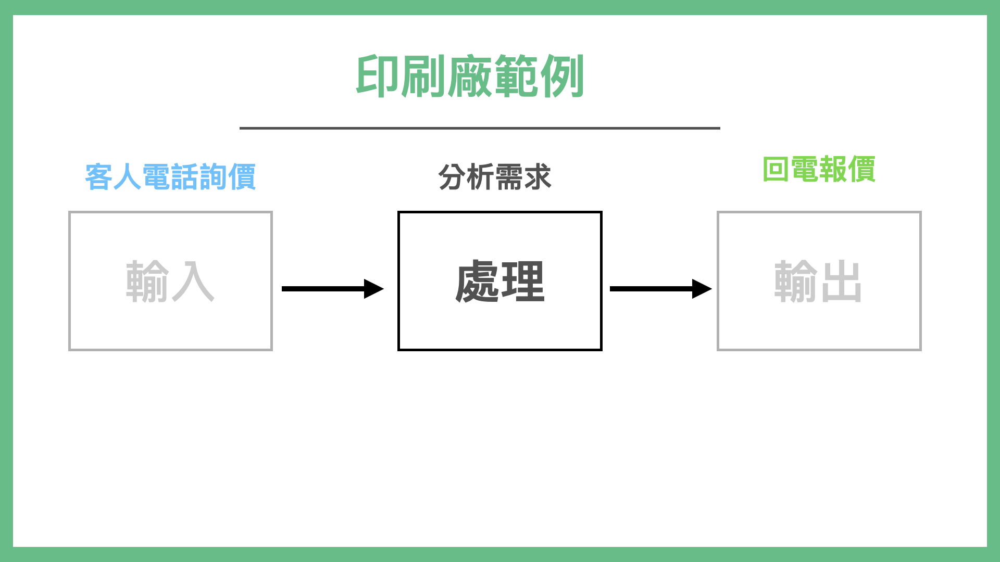
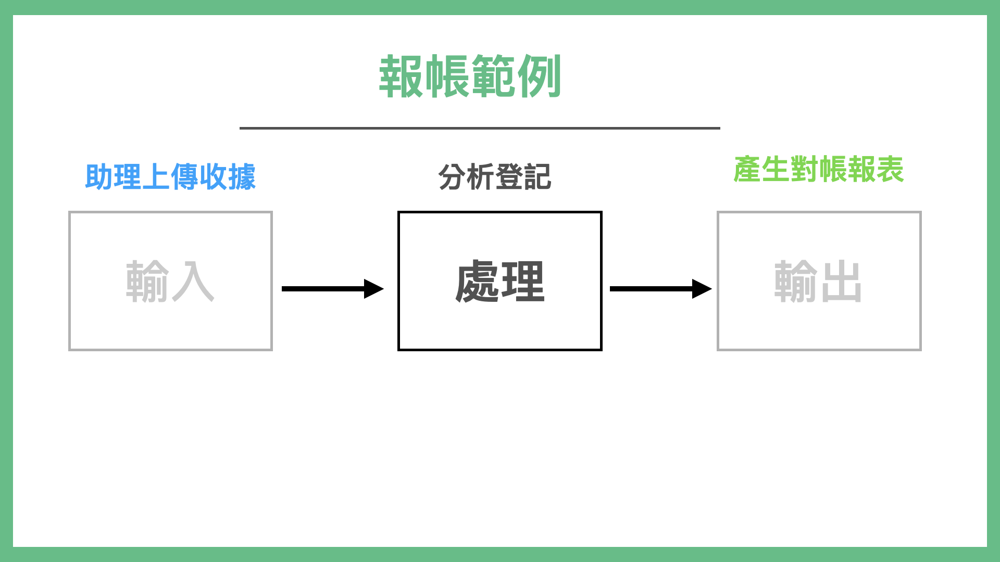
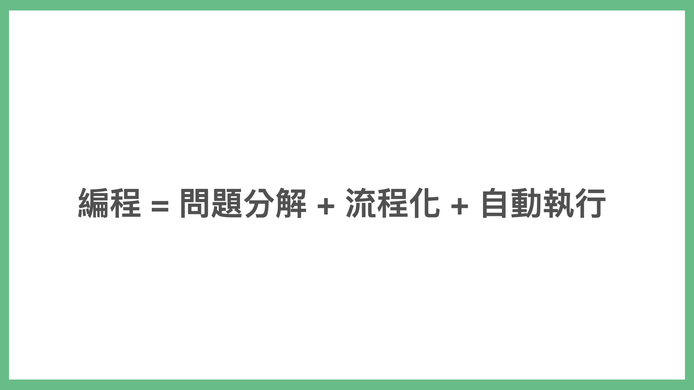

# 如何學會編程語言

目前在大眾刻意學習技能的領域裡面。我想最難的兩個領域，應該是「學習編程語言」以及「學習外國語言」。

這兩個課題，算是大家又想學，但實質上又很難學的兩門技能。

你會好奇，這本書的方法：也可以拿來攻破這兩門學習領域嗎？

答案是可以的。甚至這兩門方法學習方法可以是相通的。

## 編程的本質是「自動化」

大眾對於這兩門學問的共同恐懼就是：

* 專有名詞太多要背
* 語法太艱深容易搞錯

所以還不到學起來事倍功半的程度，就直接從入門到放棄的結果了。

但我認為，這是因為坊間絕大多書，都切錯入門角度了，帶大家繞遠路了。

怎麼說呢。讓我先問問各位讀者，為什麼你想學編程語言？

很多人想學編程前第一個問題是：我該學哪一門語言好?

坊間熱門領域有 Python, Ruby, JAVA, JavaScript, Objective-C / Swift。該選擇哪一套。

已經入門的人，都會跟你說：

* 學我這一套
* 或者是看你的需求

但是這通常會造成幾個結果：

初學者就不知道自己的需求是什麼了。怎麼知道要選什麼？更糟的是，他學了老半天，才發現學了這門語言才發現沒辦法做出他想要的東西。（比如說學了 Python 結果造不出手機程式，倒是學了一堆爬蟲技術）

這通常就是學編程初學的死結。

另外，我們在訓練編程新人時，也會遇到一個問題，對方明明熟練語法，他卻不懂要如何實在商業邏輯所需要的代碼，搞得老手非常頭痛。

後來我才發現，想學編程的人，跟在教編程的人，都搞錯了編程這門技術最大的重點：「自動化」。

是的，自動化。

我們誰學編程不是想要將自己手上重複的事情自動化呢？「自動化」才是我們真正想要做的不是嗎？

這世界上的程式語言非常多種（是百量級左右）。但這些編程語言被發明並投入使用的關鍵目的，就是「自動化」。

如果你先從語法學起，而不是從「自動化」的流程學起。非常有可能事100倍功半。

## 如何學習自動化

我在上一本書「打造超人思維」裡面，有提到過編程思維這個概念。許多人認為「編程」是一套可以解決一個超大問題的神奇魔法。

實際上，編程更像是多套小工具，組起來的自動生產線。

資深程式設計師在實際上設計一套程式時，主要的原理，先是將問題先拆小，找到可以自動化的部分先完成，不能自動化的部分先用手動 Workround，再重新組裝。

### 自動化的流程是輸入、處理、輸出

那麼自動化，又該怎麼實做呢？其實流程很單純：就是「輸入、處理、輸出」循環執行。

2020 年我心血來潮。想來做一個更簡單的編程課（直接就叫「不用寫程式的程式課」），原本教材都寫好了。但我不確定我寫的教材適不適合大家用。

於是就發了一個問卷，問大家要解決什麼問題。結果問卷回收以後我驚呆了。大家想要解的問題，跟我想的完全不一樣。自然我之前的教材都要作廢了。

大家提出了一些想要解決的問題。

如：

* 各種學會繳費單收到後，自動去繳錢
* 印刷廠電話詢價報價
* 藥師收到處方簽配好藥提醒病人回來拿藥
* 商務拜訪，收到名片，後續跟進
* 跟客戶提案、安排老師教學，
* 整理公司報帳單，分析預算花費
* 病人看診問診，判斷分類，後續衛教追蹤
* 旅遊業客人報名，預定安排行程，通知出團

乍看這些問題千奇百怪，但實際上它們的結構都是一樣的。

怎麼說呢？其實，當它們被經過整理，你會發現：

都是：輸入、處理、輸出。

「輸入、處理、輸出」這一個動作，其實有個名字叫「流程化」。

而我們認為的寫程式，其實是

一般人向工程師說，他想學寫程式時，重點往往會放在自動化

但一般人其實缺的是問題分解+流程化的思維。

而當你能將問題分解「流程化」以後，加上自動執行就變成了「自動化」。

而坊間種不同語言，有不同適合應用的場景，比如說 Python 適合做爬蟲、Ruby 適合做網站、Swift 是 iPhone 專用語言，JavaScript 多半作為網頁特效等等。

有時候我們解決一個問題，用的不是只有一套語言，甚至可能是多套語言。

但也別驚慌，我們解決周遭的事，並不需要學會那麼多套語言。更重要的是，我們如何找到「工具」把流程上的各種「問題」的「答案」，並將之串起來。

特別是網路上，關於一些最常用場景，幾乎都有自動化服務以及套件了。

比如說，如果我想要把一本網路上買到的英文書，翻譯成中文書。其實有好幾種路徑可以選擇：

1. 找工讀生，看著整本書打字出來，再找人翻譯成中文。
2. OCR 整本書，自動把每個字都掃描進去辨識出來，再找人翻譯成中文。
3. 找到這本書的打字版本（如 epub），一篇一篇手動貼到 Google Translate 翻譯成中文再拼接起來。
4. 把書拆成一章一章，寫程式自動送到 Google Translate 的 API，1 分鐘完成翻譯一本書。

寫程式並非必要，關鍵在於你如何找到問題，並且拆小。通常精通編程的人如我，遇到問題也並非一上來就寫程式。而是會想辦法把真正問題拆解出來，然後找到這條關鍵路徑上所有簡單粗暴可行的方法，先拼起來，輸出我要的結果。然後再逐一優化流程上每個節點，最終做到自動化。

當你抱持著這個觀念去「學編程」之後。通常快樂就會增加很多，因為在這個過程中，你得到的會大多是正向反餽（解決問題的快感）。而非計較糾結於自己連語法都使不好，或代碼寫的難看。

當你這個流程越熟練，你就隨之越看得懂程式上面的錯誤訊息以及找到的 Google 資訊。

有了這個概念，接著你就可以把你想要解決的日常問題，也接入我們之前的「挖問題」「流程化」「上癮迴圈」裡面了。

### 以積極的心態看待**錯誤與反饋**

學編程另外一個關鍵點，在於如何看待「錯誤與反餽」。

我過去在教編程的時候，發現一種特殊現象：

* 如果曾經唸過資訊科系的人，學工作上用的新編程語言會很快
* 反之，往往失敗率會非常高

我曾經以為這是因為在大學時，曾經有接觸計算機預備知識的差異。後來，與更多「想學編程的普通人」聊過才知道。關鍵不在於這些計算機預備知識。而是電腦發生錯誤時，對於訊息的反餽處理方式接受度有所不同。

對於程式設計師、唸過資訊科系的人，如果在學新編程語言時，如果畫面跳出紅字、錯誤。我們會認為這是正常反餽。

有可能我打錯了字，有可能我檔案放錯位置，改一下就好了。但是普通人會理解為「我是 Loser，一直出錯」。

因為普通人這輩子並沒有面對過這麼頻繁這麼密集的「出現錯誤訊息」。

但是作為程式設計師，我們在編程時，並不是寫程式一次 OK 的。更精確的來說，對職業程式設計師來，寫程式一次 OK 的機率是 0%。對，你沒看錯，就是 0%。

絕大多數程式設計師，用的是 Debug-Oriented Programming。就是寫一小段程式（或從網路上複製一小段程式碼），暴力跑。然後看自己有沒有打錯字，打錯字就修錯字。沒錯字再看剛剛寫的這一小段程式（約20-50行）有沒有跑出預期的行為。沒有就修正，如果有就再寫下一段。

所謂的編程行為，是程式設計師不斷的寫很多小代碼段，然後組成大塊代碼塊，然後再重新整理而成。

所以一天吃個 100 個 error 是超正常的。這也是為什麼資訊科系學生，出校園以後學習新語言新框架會特別快。不是因為「他們有基礎」，而是他們心理上可以「無視 Error 帶來的心靈創傷」。

如果初學者不瞭解這一點，在學習編程之路上，會很快的從入門到放棄。

而編程又為什麼那麼難學那麼容易讓人放棄呢？

這是因為很多網上的課程，要不然就是老師不給程式碼，學生必須一幕一幕的按暫停，試圖去跟著老師螢幕上的代碼一行一行敲。所以難免敲錯字。
不然就是示範代碼，不是版本環境過時，就是裡面有錯字。學生跑不起來。

如此吃力的學習環境，又沒有成就感，是正常人都放棄。

就連我在學習編程語言時，都會選擇近一兩年的教材且有複製貼上範例的教材。

因為

* 編程世界迭代之快，有可能用到了三四年前的教材，什麼都跑不起來。
* 學編程打錯字可能會搞死新手。就算是我這種老手，學新語言也發生這種事，我也吃不消。

## 觀察流程並練習小套路

世界上上百套程式語言，可以說它們底層是相通的，但其實適用場景上不同。

所謂的底層相通，指的是

1. method 的構建流程 (method 指的是我們會將一連串代碼，包裝成一段可以呼叫的代碼塊，這樣遇到類似功能，就不用重新複製一排，直接呼叫就可以了。)
2. if / else （遇到什麼狀況、就執行什麼結果）
3. for 迴圈（重複執行一段程式碼幾次）

如果你真的非常有興趣學習編程，並希望透過比較無痛的方式，練習這三個概念。推薦可以去學習蘋果在 iPad 上出的一套編程遊戲，叫 Learn to Code。這套教材寫的非常棒，念小學的小朋友也可以一下就上手，學會 iOS 上怎麼編程。

但是，每一套語言有各自優勢的程式庫與開發流程。

比如說我擅長的 Ruby on Rails 這套網站框架好了。最小的基本流程是 CRUD。

* Create 創建資料
* Read 讀取渲染資料
* Update 更新資料
* Destroy 刪除資料

動態網站開發，多半與資料庫有關。所以學打造網站，知道怎麼顯示頁面 (HTML)、美化頁面 (CSS/ JavaScript)、讀取變更資料 (資料庫)是開發一個網站要瞭解的方向。

所以當你學習 Ruby on Rails，最小學習單位就是 CRUD。練熟這套流程，相關的知識就有辦法搭建上去。

而 iOS 的主要流程是 Screen + API。

iOS 的最小單位是一個 Screen。也就是你看的手機每一個屏幕（切換），就是最小的一個單位。一套手機程式，是由無數的屏 Screen 連接起來的。

於是你要學習的就是如何構建一個一個的屏，然後把屏串起來。而有些屏上的資料，需要由外界來提供，而外界提供的方式就是使用 API 界接。API 格式有可能是 CSV、也有可能是 JSON。或其他格式。

總之，每一門語言都有一個主流程，以及構成這個主流程相關的「大」關鍵字。

要學會「編程語言」，重點不是去背術語。而是

1. 解構你要解決的問題，找到能夠解決這門的適用工具
2. 如果找不到適用工具，才考慮去找適用的工具語言
3. 先不要急著按書上面或教材上的練，可以先觀察一下整套語言的「流程」與「關鍵字」
4. 找到幾套教材，能夠讓你練習最基礎的流程套路。把這一套小流程練個兩三遍，你可以用非常拙劣但不會「卡住」的方法，拼接出你要的結果。
5. 隨著你的程式不斷的練習改版，你的學習成果自然就會有快速的進步，進入超級正迴圈
