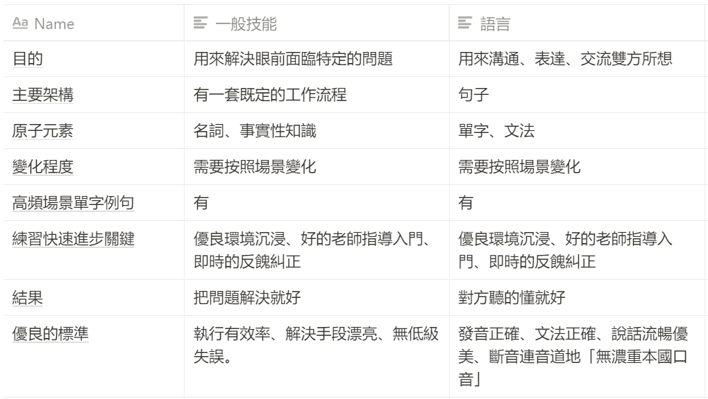

# 第十二章 如何學會一門新語言

這一章，我們要來挑戰第二個難題。學語言，在切入這個主題之前，學語言也被認為是非常難破解的一個領域：

第二語言學習為什麼難以上手，也是有相當多的原因：

- 語言的單字、詞彙、文法極其之多，不知道要從何下手
- 語言的使用與練習，是真的需要耗費大量的時間，讓人有不知道唸到何時的感覺
- 在學校學習的內容，跟現實生活脫節。枯燥無味。
- 自己去上補習班的時候，上一上覺得不是我自己有興趣的主題，也無法應用到想要的場景。
- 多數人懂得聽，但不會說。懂得讀，但不會寫。在學校花了六到十年以上學習，實際到職場上、出國情境時，完全派不上用場，瞬間變啞巴。
- 因為是在自己國家。缺乏大量正確反餽與應用場景

在本書裡面，我們很多章節都強調。過程難學、結果通靈。基本上就是「目標」與「結構」錯置。

## 你不是在「學語言」，你是在「學翻譯」

我們在上一章學習編程語言篇提到，學習編程語言本質上的目的是「自動化」。

那麼學習「第二語言」的目的呢？說穿了是「溝通」。要與不同地域、不同文化、不同思考方式的人溝通、解決面前的問題、合作完成項目。

但你知道一個恐怖的事情嗎：

我們從一百多年前至今到現在的第二語言教學法，本質上不是為了教「溝通」，而是為了教「翻譯」。

那麼自然學起來的過程與挫折就完全不一樣了。

如果我們是以「學翻譯學」的方式去學第二門語言，那麼手段：

* 最小單位是單字
* 從單字學起
* 以文章學起
* 追求文法正確無誤
* 以我們的文化、說話順序，去理解假設對方對方會造的句子。

所以這就為什麼會造成我們在學習第二語言學習時，痛苦不堪的原因：

* 都在背
* 背一大堆自己八百年都不會用上的單字與場景
* 追求正確無誤
* 如何練都是 Chinglish （中式英文）。

目標錯置，自然過程痛苦，結果通靈。

## 用學技能的方式學語言

所以若你要輕鬆的學語言，首先就是要將「目標」重置。

當你將目標重置，手段、流程、方法自然就會完全不同。

而且「第二語言溝通」甚至本來就是就是一門技能。完全可以用「學技能」的方式去破解。

如果我將這個結構圖，調出來，你就知道為什麼我會這樣說了：

而且，學語言的技術，你本來就會。只是你又把他忘記了。

你可能本人甚至就是一門語言的精通者。

為什麼我會這樣說呢？

如果將德雷福斯模型調出來，放上語言使用者對應的等級

你會驚訝的發現，我們人人甚至都算是可以是精通者。跟其他領域，「高級新手」最多的現象截然不同。

那讀者可能就會覺得非常奇怪：

一般來說，在技能學習領域裡面，往往是專精學會一門技術的人，學第二門技術，需要的時間會少非常多，甚至因為已經有自己一套的學習方法，學習過程相對輕鬆。而甚至去學第三門第四門技術，需要的時間更是會指數級下降。

那為什麼光學會第二門語言的人，對比起來就少了那麼多，而且過程萬般痛苦。

有兩個主要原因：

第一、幾乎全部的母語熟練者，不知道自己是怎麼把母語學起來的。因為我們人類的記憶、意識，幾乎是同時間與學習母語一起培養起來的。一般人甚至意識到「學習」，竟然可以有方法套路的這件事情，甚至可能都需要到12歲以後。很自然，幾乎沒有人知道，自己母語是怎麼樣被練起來的。

第二、整個學校教的是翻譯學，而不是第二語言溝通學。我也是一次在聽英文名師龍飛虎（六個月學會一門外語的作者）的直播，才知道這件事情的。現在學校裡的外語教學，其實是一門很年輕的技術，大約才一百多年出頭。而且很不幸的，這門技術，一開始的目的就是為了「翻譯」。也就是說，我們在學校裡面學第二外語的方法，不是「從零開始學一門新語言」，而是一門「將一門語言翻譯成另外一門語言」的技術。而我們甚至不知道，我們自己是在學「翻譯學」而不是「學新語言」。

當一門領域，100％ 充斥著錯誤教材時，而且從小就教你這種方法時，你甚至就會被這種言論洗腦，放棄思考。以為這才是學習語言唯一且正確的方式。

所以，在這本書裡面，我一直在說學校教育害人不淺，這都是有根據的。我們竟然花了那麼多的時間，用了錯誤的方法，折磨了自己那麼多年，結果學完了以後把東西全忘掉，甚至最後還患上對於學習的PTSD（創傷崩潰）。那不是很崩潰嗎？

## 如何用正確方法學第二語言

### STEP1　改變學習目標與對流程的認識

現在學校的第二外語之所以方法離譜的原因，看了這兩張圖你會更明白是怎麼回事：

1. 不僅老師對學習者的要求是一開始就直接到精通者程度。連學習者對自己的要求也是直接到精通者程度。事實上學習者只需要學到高級新手或者勝任者的程度。並且要求自己零失誤。
2. 「翻譯學」要求學習者，從單字、文法學起。而單字是「讀寫」，但是高級新手的程度只需要「聽」與「說」。
3. 「聽」與「說」的結構與「讀」與「寫」本質上是不一樣的結構。如果你不懂這是什麼意思，試著用語音轉寫軟體錄下來你所說的整段話。你就會發現，口說文字與書寫文字本質上有巨大文法與風格差異。但是當前學校所傳授的「翻譯學」要求我們先學「讀寫」再「聽說」。結果事實上就是你雖學會讀寫，但無法聽說。又或者你的「聽說」能力與發音極其「機械」與「詭異」。
4. 語言學習最小的流程結構，是句子非單詞。若從單詞、文法學起，多數人組不出有意義的句子，並且會被這種過程整的極其痛苦。

所以到底什麼是正確的目標、以及對流程的認識呢？

1.　降低自己對於學習語言的期望，從「對發音、文法、單字使用、口音美式」降低到「懂得基礎文法，能夠用基本句子完成簡單日常口說對話問題」或「可以熟練表達自己要說的意思，並且能夠用基本的文法詞句，查到自己要不懂的單詞片語，糾正自己」。或甚至更大膽無恥一點，只要對方聽的懂就好。

1. 從「聽、說」開始學起，而非「讀」、「寫」開始。
2. 從「句子」開始學起，而非「單詞、文法、音標」開始學起。

### STEP 2. 用跟練一般技能的方法練英語

也因為坊間傳授翻譯學的老師如此之多。如果你還買翻譯學的書回來自學，那肯定是事倍功零的。那麼，我們要如何鑒別出使用正確方法傳授的老師呢？這裡只有一個關鍵點，你得買那些能夠說多國語言的語言「天才」的書來看。

事實上這些人不能算是「天才」，我們對於「會」第二種語言，往往充滿著高級想像，往往會覺得對方是精通者（能夠形成自己說話的風格，並且可開始流利寫文章）。但事實上多國語言天才多數只對自己的第一母語精通。而對第二外國語言達到勝任者或高級新手而已。

但不管怎樣，這些人對於語言學習有著相對一般對語言「正確的認識」。

如果真要推薦的話。主要我推薦的有四本書：

1. 龍飛虎：「6個月學會任何一種外語」
2. 秋山燿平：「史上最強語言高手 教你一次學會10國語言」
3. Gabriel Wyner：跟各國人都可以聊得來：語言大師教你如何掌握三大關鍵快速精通各國語言，學了就不忘！（ Fluent Forever)
4. 游皓雲： 懂語感，無痛學好任一種外語

這四本書裡面的主幹主張都是大同小異的。只是個別細部練法、標準有細微差異。

舉例來說，龍飛虎的書「6個月學會任何一種外語」提到的六個月關鍵學習法就是這樣的：

- 第一周：大量聽＋掌握開口說話工具箱
- 第二周：聽得清晰＋自己能用一些詞溝通
- 第三周：大膽組合，大量去用
- 第四周：70個膠水詞就是英語說話的邏輯
- 第五、第六周：把功夫下在解決85%的日常英語溝通
- 第七、第八周：認識英語詞粒子，自然掌握英語語法75%最重要的規律
- 第三個月：開始用英語閱讀和寫作
- 第四個月：融入英語文化
- 第五個月：擴大使用英語的范圍，吸收反饋
- 第六個月：把第一個作品的每一塊吃透

這種方法，雖然少人使用。但反而是極其科學的。因為我們如果要快速學英語，學英語其實要：

- Step 1: 大量英聽，聽懂別人的句子。複製學習大量句子。辨認溝通的上下文。(程序性知識)
- Step 2: 補充單詞，場景句（事實性知識）
- Step 3: 掌握文法，時態（概念性知識）
- Step 4: 開始能讀文物，修正自己的英文表達能力（後設認知）

而這種方法實際上像既熟悉也陌生。第一、這就是一般人學技能的自然方式，第二、本質上這也是我們學母語中文的方法。

- Step 1: 當我們還是幼兒時，先是大量聽父母講話，終於辨認出上下詞關鍵詞後，發音，比如，一開始只能講講餓餓而已。
- Step 2: 當我們長大一點，詞庫比較多了。就能講出，餓餓，飯飯。但是父母聽到這句話就知道你餓了要吃飯。
- Step 3: 當我們大約上幼稚園後，就大概能說出「我現在肚子餓了，今天想要吃炒飯，媽媽買給我」這種複雜句子
- Step 4: 開始能閱讀故事書，能讀懂更多字與知識。

這是一個自然的學法。我們其實在過程中，沒有什麼痛苦，就自然學會了一大堆東西。

只是長大後，我們有了「羞恥」，加上周遭太多鋪天蓋地都是翻譯學教材，加上英語這門學科，我們在學習時，是強迫的被學習（不能指定老師、不能指定範圍、不能指定時長）。自然事倍功零。

### STEP 3. 對自己有耐心

學習裡面，我們見到最容易半途而廢的情形：就是對自己的進度不滿意且目標過高。通常新手往往會設下三個月到達「精通者」這種離譜的進度。然後，絕大多數的人，努力兩週後就放棄。

的確，看不到盡頭，是誰都沒有耐心。但是，學習一門技能，究竟有沒有辦法知道自己是有在進步的，最長需要多久時間練成。

其實這是有辦法的。舉例來說，就以程序員來說好了。程序員本身也是語言學習者，只是我們學的是「編程語言」。

而這門語言比較特別的是，絕大多數人是自學或半自學（由師傅帶）的。而且是網上可以快速搜得到範例複製學習，輸入結果電腦可以也立即反餽正確語法的技能。而且工程師學的本身就是「語言」（編程語言）。

而這一行對於新手到大師，普遍來說已經有了技能等級標準與所需時長。

而且如果你將編程語言與語言學習放在一起並排的話。你會發現幼兒在有了基礎認知(12個月）後，學習母語第一語言，也是相同的進度。

幼兒基本上在2-3歲基本上就懂得基礎文法，能夠用基本句子完成簡單日常口說對話問題。然後在4-6歲就會不斷的問爸媽為什麼。

然後在上小學左右可以開始形成說話的風格，並且開始寫簡單的文章。

所以學「會」一門語言，不是遙遙無期，而是最多12-18 個月（高級新手）而已。這也是那些多國語言天才學語言大概共同的時程與進度。

### STEP 4. 用本書的方法客制化自己的自學語言體驗

既然「使用第二語言溝通」是一門技能。那麼你也可以用這套方式重新設計你的學習流程：

STEP 1: 定義你的短期學習目標（可以是餐廳場景、或者是閱讀技術期刊場景）
STEP 2: 寫下你的現狀與想要到達的目標當中的差距、抱怨、煩惱
STEP 3: 挖出你真正需要的關鍵字、關鍵問題、關鍵方法、關鍵流程
STEP 4: 大量買書，找到流程。
STEP 5: 建構出你所需要的語句庫，找到能夠正確發音或能夠給予正確反餽的老師、或教材。他聽你說，多練幾遍。
STEP 6: 抽換句子裡面的單詞，練熟句子與上下文。從小套路練到大套路

如此反覆就可以快速達到你想要的語言學習目標。

這當中還有兩個學習上的竅門：

1. 需要降低記憶負擔，提高學習效率的話，可以考慮買給兒童、中學生的圖說書，圖的速度比文字吸收程度快太多。
2. 若你是為了自己的專業技術而需要學習外文的話，事實上這會更快。因為你能快速的從目標文章裡面推測出上下文，從而更快瞭解裡面陌生的單字。
